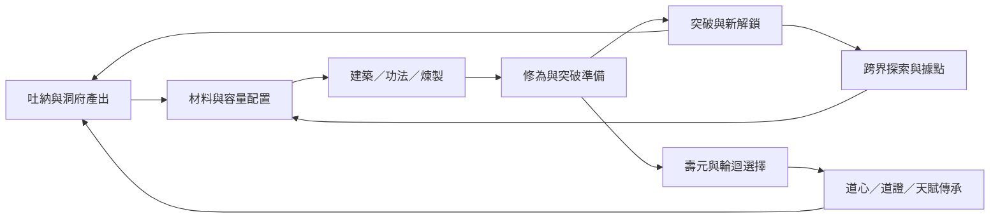
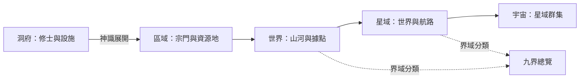

# 修仙問道 v2｜產品、玩法與世界規劃

版本：0.1 · 2026-09-12 · 前期架構提案

**產品定位：一款從洞府經營出發，以修行、突破與輪迴累積成長，逐步把玩家的神識與影響力延伸至九界和諸天宇宙的修仙放置遊戲。**

承接原始對話的 Godot AI-first 方向。新世界內容是 v2 提案；舊玩法以 `E:\Python\test1` 的規則、資料與可觀察行為作為重寫對照。本次交付規劃，不包含完成的遊戲、美術或效能測試。

## 1. 玩家應該感受到什麼

玩家第一次打開遊戲，看到雲霧間一座簡陋茅屋。吐納時，附近靈氣往修士匯聚；建造後，茅屋開始自行運轉。木屋、林場、採石場與藥圃逐步點亮山谷，飛劍沿可辨識的路線帶回材料。玩家能看見自己正在建立一處修行根基。

一般升境時，靈氣回收、陣紋圍繞修士展開；達到原作渡劫階段後，才加入天地靜止與雷光演出。結果確定後，洞府的光照、植被或建築形態留下永久變化。演出帶來成就感，也清楚交代突破結果。

當神識向外展開，原本佔滿螢幕的洞府縮成山河中的一點，再成為界域中的一道光。宏觀畫面仍保留玩家實際建立的據點與聯繫。每次尺度提升都同時開放一個新決策，例如選擇去靈界建立藥材據點，或留在人界改善修煉供給。

第一版要證明三件事：**洞府看得懂、配置有取捨、突破值得等待。** 九界與宇宙沿著這三件事擴大。

## 2. 優先順序與工作假設

| 層級 | 要求 | 決策 |
| --- | --- | --- |
| 核心 | 延續原本修仙問道的放置玩法 | 保留資源、容量、建築解鎖、修煉、突破、壽元、輪迴與傳承的因果關係 |
| 核心 | 畫面明顯升級 | 世界場景承擔主要視覺，產能、缺料、升級與突破有不同層級回饋 |
| 核心 | AI 可持續開發 | 規則可獨立測試，資料可驗證，CLI 可執行，視覺另做瀏覽器驗證 |
| 擴展 | 九界與無限宇宙 | 先手工驗證跨界差異，再加入按需生成的探索空間 |
| 工作假設 | 桌面橫版 Web-first | 先讓 PC 瀏覽器呈現完整世界與可讀 HUD；手機直式使用獨立版型，Android 等原生發行另設里程碑 |
| 工作假設 | 個人修行／本機存檔起步 | 不依賴帳號、即時多人、伺服器經濟或執行時 LLM |

不以常駐點擊或準時登入作主要進度來源。離線、低特效與安靜模式都應維持相同規則。借用 Idle Planet Miner 的持續回饋和視覺流向概念；所有修仙內容、美術與數值依本專案建立。

## 3. 原作承接與 v2 的改變

| 原系統 | 保留的玩法角色 | v2 呈現或擴展 | 首次實作階段 |
| --- | --- | --- | --- |
| 手動吐納、茅屋與新手解鎖 | 手動啟動自動產出，逐步理解資源與容量 | 吐納動作、茅屋呼吸光、山谷設施逐一啟用 | M1–M2 |
| 洞府建築／倉儲 | 費用成長、前置條件、供給與上限的瓶頸 | 點選場景建築，查看產出流向與缺口 | M1–M2 |
| 煉製與丹藥 | 將當下材料投入未來收益或突破條件 | 丹爐狀態、配方進度；是否採佇列取決於舊規則與提案選擇 | M2 |
| 功法與技能點 | 境界限制、資源分配、不同加成方向 | 修行路徑圖與效果前後比較；不更改既有 ID | M2–M3 |
| 等級、境界、突破 | 內部成長與跨境界門檻 | 渡劫演出、明確成功率與結果原因 | M2 |
| 壽元、境界年歲、天時 | 修行的時間壓力與週期環境 | 日夜／氣候／靈氣流表現，清楚顯示效果期限 | M1 核心，M3 完整呈現 |
| 道心、道證、輪迴天賦 | 多世成長、永久傳承、重新配置 | 輪迴預覽與新一世差異，留下可回顧的修行記錄 | M3 |
| 宗門、貢獻、職位與天市 | 任務、資源交換及成長支線 | 地圖中的宗門據點；維持單機規則起步 | M3 後逐項移植 |
| 機緣、靈獸與成就 | 稀有回饋、陪伴、長期目標 | 場景事件與可見靈獸；獎勵由規則系統統一入帳 | M3 後逐項移植 |
| 日誌、存讀檔、多語與 Debug | 可信進度、理解機制、可驗證性 | 分級事件摘要、存檔匯入匯出、開發用固定種子與時間推進 | M1 起 |

不能因為首版延後某系統，就把它从「舊玩法承接」清單刪除。M3 完成的是代表性完整循環；正式宣稱完整重現前，仍需完成逐項遷移矩陣。

原碼目前的 `eras.csv` 列有練氣、築基、金丹、元嬰、化神、煉虛、合體、大乘、渡劫、地仙、天仙、金仙。**修行境界與九界分開建模**：前者是玩家成長狀態，後者是探索空間與法則環境。不能把既有十二個境界直接壓成九階。

已核對的保真重點：升大境界看指定容量上限，不等於庫存繳費；壽元按已經歷境界的配額累加；輪迴清除已學功法，前世記憶提供折扣；道心保留會帶來即時加成，購買天賦則消耗道心，這項取捨應保留。原版金丹期起才有渡劫，因此 M2 的首次升境演出與高階渡劫展示分開，不能為了展示雷劫而改動新手規則。精確公式及來源見基線文件。

## 4. 核心循環與節奏

### 4.1 三種時間尺度

| 尺度 | 玩家主要行為 | 可见回饋 |
| --- | --- | --- |
| 數秒到數分鐘 | 看瓶頸、安排一次升級或修煉 | 資源去向、停機原因、修士動作與進度 |
| 一次短登入 | 使用累積資源、調整功法／配方、準備突破 | 報酬摘要、下一目標與預估時間 |
| 多次登入／多世 | 完成境界、輪迴、開拓新界 | 永久場景變化、傳承、地圖擴張與新配置 |

以上是體驗層級，不是既有成長時間的重新定價。正式速度先取得舊版基線，再以標記清楚的 v2 平衡設定調整。開發展示可使用加速存檔，但錄影與測試必須註明。

### 4.2 每次投入應有可理解的取捨

同一批靈力可以用於提升生產根基、修煉或突破準備；材料可以升建築或煉製。畫面同時提供「目前缺少」「投入後改變」「預計多久足夠」，避免玩家只看到一列紅字。

初期只新增少量內容，不新造一個與原作平行的大型戰鬥系統。渡劫先以原作的条件、機率和結算為核心；手動閃避或 QTE 不作進度必要條件。

### 4.3 視覺物流的邊界

首版飛劍與靈氣流呈現已計算的產量、目的地與停機狀態。產能高時增加光流密度，容量滿時轉為停駐或盤旋；點選後可見具體原因。

**首版沒有新增運輸損耗、飛行入帳延遲或堵塞成本。** 舊作沒有被確認的經濟規則，不能因為畫面中有飛劍就默默增加。M4 若跨界物流試玩證明有趣，再引入可見的運載量／航程規則，作獨立新機制驗收。兩階段都不以動畫抵達作為入帳依據。

## 5. 九界：每一界改變一項決策

下表全部為 **v2 暫名與玩法提案**，不宣稱出自舊作。九界以人界為起點，其餘是逐步開放的規則領域；最終命名可替換而不改 ID。部分界域可平行選擇，並不要求九條完全線性的長成長線。

| 界域暫名 | 視覺辨識 | 核心法則提案 | 玩家會改變的配置 | 與既有系統的關係 |
| --- | --- | --- | --- | --- |
| 人界 | 山谷、竹林、晨霧與燈火 | 基礎資源與容量 | 建築、倉儲與修煉的投入順序 | 承接原作開局 |
| 靈界 | 懸浮島、玉青靈潮、巨型根系 | 靈潮輪換加強不同供給 | 調整藥材與靈石生產，預備下一個週期 | 延伸天時，保留可離線運作 |
| 妖界 | 古木、菌光、巨獸剪影 | 有限靈獸協作位置 | 決定靈獸駐守產地或支援修煉 | 延伸靈獸用途 |
| 冥界 | 墨河、魂燈、倒影山門 | 傳承資源與當世收益的交換 | 決定保留當世產能或累積下世資產 | 延伸輪迴，不直接覆寫舊結算 |
| 魔界 | 赤黑裂谷、熔脈、破碎陣法 | 高產出伴隨可預覽負擔 | 配置穩定設施以換取短期供給 | 藉維持成本形成取捨，不强迫手動救火 |
| 仙界 | 金白雲海、巨型仙闕、日輪 | 有限跨界據點／樞紐位置 | 決定哪些低界繼續供給哪些進階用途 | 延伸建築與宗門經營 |
| 神界 | 幾何光輪、懸空碑文、低飽和星海 | 有限法則裝配槽 | 選擇產出、修煉或轉換導向的組合 | 延伸功法與天賦，避免只有全域倍率 |
| 混沌界 | 邊界溶解、漂移碎片、未成形天體 | 探索前可預覽的規則組合 | 選擇適合現有流派的世界，準備必要物資 | 驗證受控程序生成 |
| 太初界 | 極簡黑金、世界胚胎、星圖誕生 | 有限預算創造自己的洞天規則 | 用資源／槽位約束塑造長期配置 | 遠期創界目標，延展至諸天宇宙 |

避免新界完全取代舊界：舊界仍提供特定材料、功法路徑或靈獸生態。也避免每次登入逐界點十幾個按鈕：跨界之前先提供總覽、穩定自動化與異常摘要。每項法則必須能以一兩句話說明，並可從一個配置變更觀察效果。

## 6. 宏觀世界與「無限宇宙」的可玩定義

採用兩個獨立維度：

- **位置層級**：宇宙 → 星域 → 世界 → 區域 → 地點／洞府。
- **界域法則**：每個世界的 RealmProfile 指定九界之一，決定色彩、生態、資源結構與規則。

九界總覽是一張依界域分類的神識圖，可以把分布在不同星域的同類世界整理到一起；它不是在位置樹上再插入一層含糊的「九界空間」。玩家始終能返回自己的洞府。

尺度切換以短暫鏡頭對位、雲層遮罩與層級場景過渡呈現連續感。玩家剛建成的洞府在上一層仍有具名光點，成功突破後新的世界路徑變得可達。距離、形體、音景與活動密度共同創造宏觀感。

「無限」定義為按需延展、能持續尋找不同配置條件的世界地址空間。首發提供的素材、事件與法則是有限內容集合；不承諾無限獨特劇情、無限同時運算或每顆天體都能自由行走。

探索循環為：查看候選世界摘要 → 比較資源、法則與代價 → 派遣／進入 → 建立有限據點 → 取得新材料或配置能力 → 選擇下一個目的地。每個世界至少應有一個可描述的策略差異，不能只改名字與背景色。

原型期先以 2 個手工世界驗證不同有效策略，再用至少 3 種手工規則原型檢驗生成組合。若所有世界都採相同最優配置，先改善規則，再擴大生成量。

## 7. 美術、鏡頭與互動方向

### 7.1 視覺基線

2026-09-13 補充：依使用者提供的 GodTower 圖譜與工筆人物，主風格收斂為「工筆人物古卷＋細古金／青玉印章＋流動靈脈」，內景、洞府與諸天共享視覺語言。具體布局、動效、資產拆分及玩法映射見 [圖譜整合設計](04-meridian-visual-integration.md)。護山試煉屬後續可選提案，不加入M2首切片前置。

建議採高畫質東方幻想插畫、清楚剪影與局部寫意留白。遠景有山水尺度，中景有可讀建築，近景有修士、飛劍與靈獸。UI 使用穩定易讀字體，書法只出現在短標題或演出文字。

第一條渲染路線為 **2D 分層場景＋2.5D 視差＋局部 Shader**。球體或洞天可用法線／光照貼圖與旋轉紋理表現體積；只有在原型證明鏡頭需要真實立體遮擋時才加入小範圍 3D。全畫面自由 3D 宇宙不列首版依賴。

| 畫面 | 構圖與動態 | 與玩法對應 |
| --- | --- | --- |
| 洞府 | 前景枝葉、中景設施、遠山雲霧，固定主光源 | 看見設施是否運作及成長前後差異 |
| 修煉 | 呼吸節奏、衣袖／法器輕動、靈氣向中心匯聚 | 持續進度可感知，安靜模式可簡化 |
| 生產 | 少量代表性飛劍與軌跡，供給方向清楚 | 對應產出與停機原因，不是一資源一粒子 |
| 突破 | 一般升境為聚氣／蛻變；符合渡劫規則才演出蓄勢／天劫／結果 | 結果先由核心提交，動畫可跳過或重播 |
| 九界／宇宙 | 群集、雲海或星霧，重要據點優先標註 | 能找到家、看見下一目標與跨界關係 |

基本操作應立即出現按壓回饋；成功升級有建築狀態变化；重大突破才使用鏡頭震動、全景光照與音樂層次。避免每次採集都爆出大量數字，稀釋重要事件。

### 7.2 直式畫面

預設場景約佔可用高度 55–65%，底部保留下一目標與主要操作，頂部顯示境界、壽元和少量當前關鍵資源。這是試作比例，須在實機調整。

建築詳情使用底部抽屜；開啟後仍能看見選中的建築。完整資源、功法、宗門等管理界面由導航進入。宇宙視角用麵包屑、返回洞府與明確縮放層級，拖動與捏合之外也提供按鈕。

提供減少動態效果、音量、低特效、文字大小及高對比選項。即使关闭粒子，狀態色、圖示和文字仍能說明生產、缺料、容量滿與突破結果。

### 7.3 資產產線

先完成一張洞府風格基準和一張突破分鏡，再建立遠景／中景／建築／修士／特效的分層規格。生成式美術可作草圖和基礎素材來源，但每張投入遊戲的素材仍須檢查透明邊緣、透視、光向、比例、縮圖可讀性與動畫穩定性。

资产記錄 ID、用途、來源或提示詞、授權紀錄、版本、像素尺寸、樞紐點、層級與匯入設定。可互動建築至少有未建造、運作、停機／容量滿與升級差異。第一版集中製作人界，其他八界先有文字、美術方向與節點符號。

## 8. 分段範圍與產品驗收

| 階段 | 可玩承諾 | 內容邊界 |
| --- | --- | --- |
| M1 規則核心 | 舊版代表規則在 GDScript 可重現，能保存與補時間 | 無正式美術 |
| M2 洞府切片 | 人界開局到首次突破；看懂供給、配置與演出 | 一座洞府、舊版必要新手設施／配方／功法，完整存讀檔 |
| M3 多世成長 | 一次輪迴與傳承，第二段修行產生新配置；逐項移植舊系統 | 不宣稱完整九界或全部舊內容已完成 |
| M4 跨界證明 | 人界與一個第二界可操作，至少一項法則改變配置 | 其餘界域只顯示未開放的遠景 |
| M5 宇宙擴充 | 受控生成、探索、有限據點管理與內容逐界製作 | 擴大前先量測生成品質、存檔和效能 |

M2 的暫定易用性門檻：五位新測試者中至少四位在不接受口頭指導下找到下一目標、辨認一次瓶頸並完成一次有效配置。通關時間另與舊版基線比較，不強行把所有人壓進十分鐘突破。

M4 的門檻：在第二界至少一次改變原配置能改善某一目標，而且有可解釋的代價；維持原配置仍可理解並继续遊玩。此驗收比顯示九個可點擊但沒有內容的入口更能證明世界擴展成立。

## 9. 需要保留的設計問題

尚待試玩決定：壽元是否沿用所有舊版懲罰；跨界物流何時加入實際運輸規則；九界法則與宗門／靈獸如何分工；輪迴後的重複操作能自動化到何種程度。這些問題不妨礙先完成規則抽取、洞府視覺與存檔架構。

完整來源與舊規則差異见 [需求來源與基線](00-source-baseline.md)；技術實作見 [架構文件](02-technical-architecture.md)；可交給 Codex 的工作順序見 [里程碑與交接](03-delivery-plan.md)。
