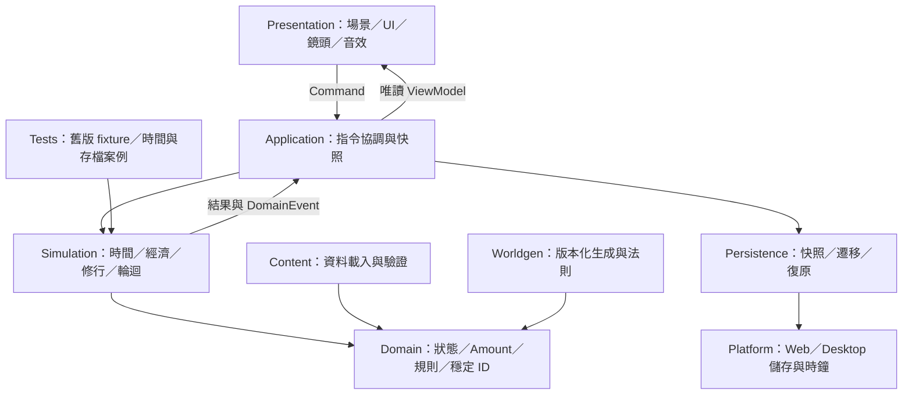
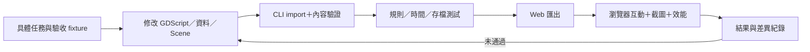

# 修仙問道 v2｜Godot AI-first 技術架構

2026-10-05 D2-R1：Godot IslandWorld包含丹霞独立body／landmark；世界／管理雙向路由共用herb狀態，所有航船讀實際trips，不發收益。四島HFlowContainer以HUD／紙面內距／導航安全範圍換行；遠島隱藏祖島遠景題字，規則／schema3／res1-d-2／core-flow-10-danxia不變。53/53、最後world38＋管理87與獨立Web子範圍見[驗收](verification/res1-d2-r1.md)，完整D2與R2仍未放行。

2026-10-04 R2診斷增補：profile從_process入口含preflight開始，提前返回結束，背景結算await前關閉以免將等待當CPU；只在隔離profile頁觀察Long Animation Frames並保存scalar脚本入口，summary不加總browser與GDScript elapsed spans。83.3ms rAF對應MainLoop_runner84.1ms、process0.4ms，只縮小到Web引擎入口，無WASM內call stack／GPU根因。正常橋接關閉且與profile export同PCK；51/51／world26通過，嚴格60未過。[證據與限制](verification/res1-c2-main-loop-tracing.md)。

2026-10-04 R2：定時HUD使用state身分＋revision保護View，明確命令／debug／載入refresh強制重建；既有修行封頂改值時清除View。SaveCodec保留首次JSON往返／解析後checksum，重用首次文字加入固定SHA256欄位以省略最後整體序列化；不將checksum近整數正規化當保存資料。schema／rules不變，JSON欄位順序不同、完整解析envelope比對與故障重試通過。固定快照成本与長幀關聯見[R2驗收](verification/res1-c2-view-encode-longframes.md)；166.8ms rAF＋180ms LongTask同窗已量process0.3ms仍無call stack，不宣稱GPU／GC根因或嚴格60通過。

2026-10-04 PERF-R2續輪：無命令準備新增島嶼固定點偵測。只有無在途／加工倒數、完整economy除tick外不變、祖島Amount未變時省略重複檢查；監看持有的resource entry／Amount，tick只替換value，命令後一律重建。祖島生產的無變化結果只在乘區未重建、經濟靜止且庫存未變時重用；靈界耗料立即失效。壽元與修行倍率快取在BUFF到期／時辰邊界失效，修行時間仍逐秒相加。天時tick只做一次既有同步，小景滿兩件時略過eligible掃描，RNG不動。FrameBudget **14ms**只控制讓出；schema／rules／CAP不變。51/51＋145精確檢查／Web retry49、節流長離線9.801／9.777秒有界通過，完整證據見 [續輪](verification/res1-c2-perf-r2.md#2026-10-04-續輪交付節流長離線缺口)。下面10ms結果保留為較早歷史。

2026-10-04較早10ms版 PERF-R2：一次無命令結算快取宗門／靈獸被動、BUFF到期與時辰邊界乘區、相同乘區的一秒Amount delta／基礎容量；當秒庫存與預留仍重讀。靈獸初始化通過零tick／壽盡保護後才發生。FrameBudget 10ms只控制讓出，不改逐秒事件／RNG／收益與保存版本。最終51/51、121精確比對、Web retry49通過；本機48h恢復7.75秒，節流長離線13.55秒仍未過，續PERF-R2，不跳D。[R2驗收](verification/res1-c2-perf-r2.md)。

2026-10-04 RES1-C2-PERF最新：living_abode View以GameState身分＋revision快取，命令／debug／重試明確refresh。TimeAdvancer prepared只限一次無命令結算，純規則參數重用、BUFF／天時／靈獸／保留容量／事件仍逐秒；不寫入保存，不改schema3／core-flow-9。Runtime字型由來源corpus生成且保留metrics／wght，原字型保留；Web原MP3依播放需求HTTPRequest另載，平台資產URL解析不介入收益。Node只產生壓縮與音樂companions，正常遊戲仍Godot／Compatibility單執行緒。51/51回歸、107精確tick/font、Web retry49通過；600tick CPU約減49.8%，長離線本機18.19秒仍超10秒。[效能證據／邊界](verification/res1-c2-perf.md)。

2026-10-04 RES1-C3 最新：正常living_abode初始化附掛processing／IslandProgression，基礎ContentLoader仍可獨立使用。玩家築基後透過已驗證歸檔／候選提交啟用，舊檔不自動改造。分層PNG與尺寸變更重新取景已交付；50/50、normal world22通過。30+為後續容量方向，現有定義仍首段專用，未聲稱通用36島引擎已完成。[C3](verification/res1-c3-art-integration.md)／[新規格](15-island-expansion-and-art-direction.md)。下方preview限定為歷史；C2效能缺口保留。

2026-10-04 C2-R1 最新：async桌面保存追加矩陣146 checks／全量50/50已通過；實測冷啟動／下載／幀時間超預算，整體未放行。原生50次切島不代表Web／GPU長期記憶體。下一C2-PERF，正式manifest保持opt-in；[收尾證據](verification/res1-c2-closure.md)。下方前輪「新async追加矩陣待補」保留歷史。

2026-10-04 RES1-C2：三島獨立SVG世界候選／同路由點擊／短Banner、Web候選分批結算（platform FrameBudget、逐秒規則不讀時間）、摘要內部捲動與固定關閉已實作。27 checks、固定50/50與補充世界14 checks、桌面兩版型雙鏈T2／重載、48h拒寫／重試已有有界證據。正式manifest未附掛，候選美術／節奏、實機／高DPR／效能與新async完整故障追加矩陣仍待補；歷史「尚未實作」按日期保留，以 [C2驗收](verification/res1-c2.md) 為最新範圍。

版本：0.1 · 2026-09-12 · 實作前設計

2026-10-03 RES1 架構增補（尚未實作）：依 [多島資源規格 §7](14-multi-island-resource-progression.md)在既有核心加入地方庫存、批次加工、固定航線／在途貨物與容量保留。核心按到貨／完工／缺料等邊界推進；不能沿用固定產率整段相乘推定多階鏈等價。新 schema／rules／content 版本、祖島舊庫存映射、單一權威庫存与保存重試列 RES1-A/B，Amount 支援邊界仍有效。下文三個活躍據點為原型歷史預算；RES1 先三島、再 Era 3 第四島，擴充前量測負載，不推定已驗效能。

2026-10-03 RES1-B 實作增補：上述地方庫存／整數時間加工／固定航線／容量保留及 schema 3 核心已有 251 checks 與 native 三程序證據，詳 [驗收](verification/res1-b.md)。正式 content opt-in 門檻保持；瀏覽器可靠保存及三島介面尚未交付。歷史實作前設計保留，不能作已驗 Web 的證據。

本架構依 `E:\Python\test1` 的 TypeScript／Vite／PixiJS 專案與規則測試規劃，程式碼尚未移植。核心原則是讓規則、時間與儲存可獨立驗證，再由場景呈現同一份可信狀態。

## 1. 技術決策與依據

| 決策 | 起始方案 | 原因與改變條件 |
| --- | --- | --- |
| 引擎 | Godot 4.7.2 stable，模板同版 | 官方檔案庫已核實；固定版本便於重現與回歸 |
| 語言 | 型別化 GDScript | 與原先 Godot／Web 方向一致；規則以 RefCounted 與純函式撰寫 |
| 渲染 | Compatibility；2D＋2.5D | 先在手機 Web 驗證效果；小範圍 3D 需獨立效能驗證 |
| Web | 單執行緒、靜態匯出、自訂 HTML shell | 起步不依賴跨來源隔離與 GDExtension |
| 平台層 | Web 起步，Windows 驗證；原生行動端後續 | 避免把全平台簽章／SDK 工作塞入首個切片 |
| 儲存 | 本機完整快照＋兩代復原＋手動匯出匯入 | 未規劃多人經濟前不引入後端 |
| 數值 | 與舊 break_eternity 相容的 Amount 邊界 | 大數已存在，不能先用 int 或普通 float 冒充完整相容 |
| 開發工具 | CLI 必備，MCP 可選 | 沒有 MCP 仍須可以 import、執行規則驗證、匯出與測試 |

版本證據見 [Godot 官方檔案庫](https://godotengine.org/download/archive/)。Web 使用 WebAssembly／WebGL 2.0、Compatibility，Godot 4 C# Web 匯出受限，因此採 GDScript。[官方 Web 匯出文件](https://docs.godotengine.org/en/stable/tutorials/export/exporting_for_web.html)

## 2. 模組邊界



| 模組 | 責任 | 不可承擔的責任 |
| --- | --- | --- |
| domain | GameState、各世／跨世狀態、定義 ID、數值與規則結果 | 不存 Node、Texture、系統時間或 UI callback |
| simulation | 命令驗證、資源轉換、時間推進、加成、突破、輪迴 | 不播放粒子、不依賴 `_process()` 頻率 |
| application | 組裝服務、提交指令、產生摘要、協調保存 | 不複製第二份經濟公式 |
| presentation | 輸入、ViewModel、場景與特效 | 不直接增減庫存、不決定成功率 |
| content | CSV／JSON 轉换、ID／前置檢查、內容 manifest | 不在 runtime 以任意腳本文字定義法則 |
| persistence | schema、編解碼、驗證、匯入、世代快照 | 不自行猜测未支援的歷史欄位 |
| worldgen | 世界描述、地圖地址、受限規則組合 | 不建立所有宇宙節點或讓遠景持續逐幀模擬 |
| platform | 儲存、時間來源、頁面生命週期、檔案對話 | 不承載修仙業務規則 |

使用少量明確事件與介面，初期不導入 ECS、微服務或萬用事件腳本引擎。Autoload 只保留啟動服務及必要路由；單一 `GameManager` 不得成為所有系統的存取捷徑。

## 3. 建議檔案與 Scene 結構

以下為待建立的專案結構，不是目前已存在的檔案。

```text
Dao2/
  project.godot
  export_presets.cfg
  docs/                         規劃、ADR、規則差異與驗證紀錄
  src/
    domain/                     GameState、Amount、各系統資料型別
    simulation/                 Command、Reducer、TimeAdvancer、規則
    application/                GameSession、SnapshotCoordinator
    persistence/                SaveCodec、LegacyImporter、Migration
    platform/                   Clock、Storage、WebBridge
    worldgen/                   WorldAddress、Generator、RealmProfile
    presentation/               ViewModel、Controller、EffectDirector
  scenes/
    boot/Boot.tscn
    shell/GameShell.tscn
    world/Abode.tscn
    world/RegionMap.tscn
    world/WorldMap.tscn
    world/StarfieldMap.tscn
    world/UniverseMap.tscn
    world/NineRealmsOverview.tscn
    ui/BuildingDrawer.tscn
    ui/BreakthroughPanel.tscn
    ui/OfflineReport.tscn
    fx/BreakthroughSequence.tscn
  content/{resources,buildings,skills,eras,realms,recipes}/
  assets/{backgrounds,buildings,characters,fx,audio,ui}/
  tests/{unit,contracts,fixtures,integration}/
  tools/{data_import,test_runner,web_shell}/
  build/                        不入版本控制
```

初期只建立實作需要的檔案。宇宙等尚未實作場景先留在文件，不生成大量空殼。

`GameShell` 組成：WorldViewport → SceneRouter；CanvasLayer → TopStatus、GoalCard、BottomNavigation、DetailDrawer、ModalHost；EffectDirector 讀取事件。切換場景不會建立新 GameState，也不會停掉其他已啟用產線的規則推進。

所有正式 Godot 畫面尺寸、`CanvasLayer`／`Control` 版面、Web canvas、觸控與瀏覽器驗收依 [響應式介面與 Web 畫布規格](07-responsive-ui-web-spec.md) 執行。`1280×720` 只作構圖基準；世界和 UI 不得以固定瀏覽器尺寸或生成 HTML 實作。

## 4. 指令、狀態與資料契約

所有玩家行為使用 `Command{command_id,type,payload,expected_revision}`。Session 檢查 revision 與前置條件，成功回傳 `CommandResult{new_revision,events,changed_ids}`，失敗回傳具名原因，如 `INSUFFICIENT_RESOURCE`、`CAPACITY_REQUIREMENT`、`LIFESPAN_EXHAUSTED`。失敗指令不扣料。

首批命令：`Gather`、`UpgradeBuilding`、`Craft`、`LearnSkill`、`LevelUp`、`AscendEra`、`AttemptTribulation`、`Reincarnate`。`Reincarnate` 在核心再次驗證資格，不只依賴按鈕禁用。新加入的佇列或跨界派遣另設命令，不能藏在畫面控制器。

成功升級的順序為：核對 ID 和等級 → 計算舊版同等成本 → 檢查庫存與容量 → 一次提交扣款與等級變更 → 重算相關產率／上限 → 發出事件。顯示動畫晚於狀態提交；重播不再執行指令。

| 資料 | 主要欄位 |
| --- | --- |
| GameState | state_revision、sim_tick、current_life、meta_progress、resources、buildings、skills、sect、beasts、worlds、rng_streams |
| LifeState | life_id、era_id、level、age_ticks、training_ticks、pill_effects、active_world_id |
| MetaProgress | reincarnation_count、dao_heart、dao_proof、talents、highest_era、beast_souls、achievement_flags |
| ResourceState | resource_id、Amount value、unlocked、ever_obtained；capacity／rate 由規則重算 |
| BuildingDefinition | id、costs、cost_factor、effects、era_requirement、prerequisites、presentation_id |
| RealmProfile | realm_id、law_ids、allowed_resource_tags、palette_id、scene_style_id |
| WorldRecord | address、generator_version、content_version、realm_id、生成描述、玩家變更與據點 |

上述型別為 v2 提案；舊資料映射先經 LegacyImporter，避免沿用同名但不同語意欄位。所有名稱以 i18n key 顯示；`era_id`、`realm_id`、`resource_id` 分開命名。

加成運算順序必須從舊版純規則抽取。不要先假設所有效果都能套用同一條「基礎 × 全加成」公式。每個效果註明來源、單位、適用範圍、疊加方式與上限，tooltip 使用核心回傳的拆解值。

## 5. 大數與確定性：M0 的必要門檻

舊 `break_eternity.js` 使用 `sign/layer/mag` 分層指數表示，支援超越一般科學記號範圍；它不是任意精確整數。資源、容量、產率、道心道證已依賴此行為。v2 不可用 Godot `int`、`float` 或只有 mantissa/exponent 的格式承諾相容。

建立 `Amount` 值型別與集中運算接口：parse、serialize、compare、add/subtract、multiply/divide、power、log、floor、clamp、display。核心一律經 Amount，不容许散落的 `to_float()`；畫面可取有界比例作進度條。時間、有限計數與 enum 使用有界整數。

M0 先用舊函式產出語言無關測試向量，涵蓋 0、負號中間值、小數、倍率、接近容量、科學記號、第二層指數、字串 round-trip，以及超出支援範圍的拒絕行為。普通整數樣本要求完全一致；小數與分層大數依已記錄的比較與誤差政策驗證，不能宣稱全部位元精確。

優先評估 GDScript 相容實作或經查驗授權與品質的既有實作。若 M0 無法在品質／效能預算內達標，可先保留 TypeScript 參考器作離線 fixture 產生工具；**不默默把 Web JavaScript bridge 變成正式唯一規則核心**，否則原生匯出需第二條執行路線。正式架構分岔寫入 ADR，重新評估平台和成本。未通過大數驗證時只可標示早期受限原型，不能導入全部舊存檔。

亂數分為 gameplay、worldgen、cosmetic，互不消耗序列。舊模擬器的 `SeededRandom` 可作相容參考，移植時需對齊字串雜湊、UTF-16 碼元和 32 位溢位／位移語意。正式 runtime 原有 `Math.random()` 的流程不能倒推出歷史結果；新存檔從切換點起保存 RNG 版本及狀態。

## 6. 時間推進與離線結算

2026-10-03 ISLAND1 實作：schema 2 新增可選 `state.abode_scenery`，內部 version 1 保存獨立 RNG／serial／remaining／active finds；缺欄位讀為空，非法資料拒读。`rules_version=core-flow-4-scenery`。線上／離線透過 TimeAdvancer 共用出生路徑，採收只透過 Session 命令，重試保存不重發獎；[契約](13-island-scenery-and-courtyard-spec.md)。

### 6.1 原作承接與修正邊界

舊作壽元以實際一分鐘對應一祀，資源更新與壽元採不同時間路徑；讀檔後資源補算未見於已檢查啟動路徑。v2 將統一線上／離線規則，列為明確的行為改善，不把它寫成原版已具有的功能。

採可注入 Clock：在線取單調經過時間，跨關閉／重新開啟用已保存 UTC 算差。GameTime 統一換算成整數 tick，例如 1 tick = 1 ms；保留餘數，畫面插值另計。

舊壽元停止行為作 `legacy_parity` 的規則基線。若產品決定離線壽盡只暫停於事件選擇，或提供寬限，寫為 `v2` 變更，不無聲取消原作壽元。兩者皆不能在無明確自動策略時連續幫玩家輪迴多世。

### 6.2 統一推進器

`advance_to(target_tick)` 按會改變規則的時間邊界推進：丹藥失效、修煉門檻、天時切換、缺料、容量滿、壽盡、自動操作。區間內產率固定時解析積分；只在邊界重新求值。M2 未加入長製作佇列時不額外建立不存在的完成事件。

同一 tick 按 `(tick,priority,stable_id)` 固定排序。具體優先序以原版短程對照確認，例如壽盡邊界應先決定是否允许當刻產出。自動建造或自動合成會改變後續產率，不能把長離線時間直接乘上最後一刻產率。

核心等價性：在相同命令時間點與規則下，推進 600 秒與分段推進到相同終點應得到同等狀態、事件和 RNG；顯示幀率不參與計算。超長時間採可讓出主執行緒的批次，保存 checkpoint，顯示結算進度，避免單執行緒 Web 無回應。

### 6.3 結算政策與提交

暫定離線資源與修煉收益只計最前面的 24 小時，僅為 v2 待試玩設定，且不得超過壽盡或必要選擇邊界。年歲、丹藥期限與天時則按完整真實間隔推進；超出收益上限後只處理時間效果，不繼續產出／修煉或自動操作。不得把收益上限同時當成壽元凍結。壽盡後仍不自動輪迴。此政策可能影響回鍋體驗，須與舊版平衡一起試玩；調整須更新 rules_version。

成功結算後 UTC 游標直接提交至本次觀測的現在時間，包含超上限而放棄收益的區間，不留下下次可再領的時間債務。摘要分別顯示實際離開時間、有效收益時間、年歲變化、到期效果和停止原因。例：離開48小時，最多計最前24小時且受壽元限制，時間效果計48小時；立即重載不再結算剩餘24小時。

流程：讀取最後有效快照 → 算出非負可結算區間 → 依策略推進至時間／壽盡／必要選擇邊界 → 同一快照寫入資源、模擬時間、UTC 結算游標與報告 ID → 驗證保存 → 顯示摘要。關閉摘要只是 UI 操作，不是再領一次獎勵。

時鐘倒退給零新增離線時間且不把結算游標往回移；向前跳躍受上限約束。前景恢復和重新載入都經同一協調器，不各自補一次。純本機方案保障正常流程一致性，不承諾阻止玩家修改系統時間或存檔。

2026-10-03 RES1-B-WEB-R1：權威 Web 儲存為 localStorage，薄 adapter 同步 setItem／readback 與桌面真實重載已驗；每 namespace lifetime Web Lock 保護單一寫入者，無鎖／讀取失敗停止啟動；Web幀恢復與離線共用副本結算＋保存，失敗保留source／游標並提供原生Godot重試。schema3／rules core-flow-8 保持；詳 [驗收](verification/res1-b-web-r1.md)。裝置／OS自然凍結／長離線效能未由此推定。

## 7. 新存檔與舊格式遷移

### 7.1 v2 快照

```json
{
  "schema_version": 2,
  "game_version": "0.1.0",
  "content_version": "manifest-hash",
  "rules_version": "legacy-parity-1",
  "amount_format_version": 1,
  "generator_version": 1,
  "save_id": "local-save-id",
  "revision": 42,
  "saved_at_utc_ms": "1789160000000",
  "settled_until_utc_ms": "1789160000000",
  "sim_tick": "3600000",
  "state": {},
  "rng_streams": {},
  "last_offline_report": null,
  "checksum": "payload-integrity-check"
}
```

這是格式輪廓示例，不可當有效遊戲存檔。大數採版本化字串編碼，整數時間也用十進位字串避免跨語言 JSON 精度問題；checksum 用於偵測損壞，不作防作弊或身分認證。

本機採兩個世代槽位與提交序號，載入選完整驗證且 revision 最新的候選；不要把同一份壞內容同時覆蓋主檔與備份。匯入先在記憶體完成驗證與差異報告，成功後另存新槽位，保留匯入原文供恢復。

Web 需以實際平台儲存確認持久化完成，不能把 `FileAccess.close()` 等同於瀏覽器已落盤。M0 平台探針比較 Godot `user://` 的落盤可觀察性，必要時由薄 WebStorageAdapter 以 IndexedDB transaction 完成訊號提交快照；二者擇一作權威儲存。要測試關閉、重載、空間不足與儲存被拒絕。瀏覽器可能限制或清除儲存，因此手動匯出匯入從首版提供。[官方持久化說明](https://docs.godotengine.org/en/stable/tutorials/export/exporting_for_web.html#using-cookies-for-data-persistence)

同一存檔同時開兩分頁時只允許一個寫入者。平台層取得每存檔互斥控制並驗證 revision；其餘分頁只讀或請玩家切換。鎖機制和可用性在 M0 實測，不能只用 UI 提示代替寫入互斥。

### 7.2 舊存檔匯入規格

舊版 `saveSystem.ts` 固定格式版本 `1.0`，與遊戲 v0.46.6 不同。接受 JSON 原文或 UTF-8 Base64 分享碼，頂層可含 `{v,o,t,p,r,b,s,beastData}` 以及 loader 已支援的長鍵名。

| 舊資料 | v2 對應及處理 |
| --- | --- |
| v／version | 路由到 legacy importer，不直接覆寫成新版本 |
| o／onboarding 相關資訊 | 保存 schema 語意，不把所有舊玩家當新手 |
| t／timestamp | 作來源時間；首次匯入是否补算需明確政策，避免多年時間戳誤領 |
| p／player | 拆成當世、跨世、宗門與效果狀態；逐欄驗證 |
| r／resources 的 v/u/e | 數量、解鎖、曾取得；容量和產率重新計算 |
| b／buildings、s／skills | 穩定 ID 對照，保留解鎖與已學等級；未知 ID 列入報告 |
| beastData | 統一至新快照；檢查缺失、版本與其餘獸資料来源 |
| 其他 localStorage 分散鍵 | 僅在使用者提供完整匯出時整合；單一分享碼不保證含全資料 |

舊站與新站若網域不同，不能直接讀取對方 localStorage。主要路徑為使用者匯出 → 選擇檔案／貼碼 → 預覽欄位映射和缺失 → 建立新存檔。不可自動假設已讀到瀏覽器中的完整玩家進度。

來源倉庫根目錄可見舊存檔樣本候選，本輪未解析其内容。M1 需識別格式並製作去識別化測試樣本，涵蓋開局、中期、輪迴後、大數、靈獸、缺欄位與損壞檔。跨版本無損續玩只有通過這些案例後才宣告支援。

## 8. 世界生成、LOD 與規模控制

世界地址使用 `universe_seed / sector_id / world_id / region_id / location_id`；RealmProfile 是世界的另一屬性。地址是資料 ID，不是巨大浮點座標。每一層場景使用自己的局部座標及載入範圍。

生成器由固定種子、生成版本、內容 manifest 產出 WorldDescriptor，先選有限手工原型，再套允許的法則、資源與事件組合。驗證前置可達、必需資源有來源、沒有無限套利、法則不互斥、至少一項策略差異。驗證失敗回退到已知可玩模板，並記錄原因。

僅為可見／已探索世界生成描述；只模擬玩家啟用的據點。未探索節點是可重建描述，已探索或被修改的世界保存描述／差異。升級生成版本不重新洗掉玩家現有世界；對舊存檔維持舊生成版本或進行明確遷移。

| 顯示層級 | 載入內容 | 經濟計算 |
| --- | --- | --- |
| 洞府 | 修士、可互動建築、代表飛劍 | 同一份全局活躍據點模擬 |
| 區域／世界 | 精簡據點、主要航線、產出摘要 | 不因遠離畫面而停產 |
| 星域／宇宙 | 世界圖示、群集與聚合流量 | 不建立背景星星的經濟實體 |
| 九界總覽 | 依 RealmProfile 分組的世界索引 | 只是查詢視圖，不複製狀態 |

預算起點：首切片只一個活躍洞府，跨界驗證最多三個活躍據點；正式上限以效能／玩法決定。探索地址可以持續延展，活躍模擬數量和詳細存檔量仍有界；遠期提供停用據點與封存摘要以控制存檔成長。

## 9. Web 與特效工程

本案自訂 HTML shell 處理啟動、載入進度、音訊啟用、生命週期、下載匯入與儲存橋接。不要直接修改每次匯出都被覆蓋的生成 HTML。

Compatibility 能力應以鎖定版本和匯出成品驗證。主要效果先用分層視差、加色光暈貼圖、短軌跡與簡單 Shader；粒子、後處理、光源逐項加入並量測。低品質關閉昂貴效果但保留玩法狀態提示。

文字與關鍵 UI 按實際 CSS viewport 檢查，不能只看引擎內設計解析度。高 DPI 對世界畫面可限制渲染倍率，UI 保持清晰；切換場景釋放不用的貼圖和粒子池，取消遠景不可見動畫。

音訊由首次使用者操作啟用；環境層與突破效果有獨立音量。背景分頁暫停時不靠 `_process()` 維持收益，恢复走離線協調器。[官方背景限制](https://docs.godotengine.org/en/stable/tutorials/export/exporting_for_web.html#background-processing)

靜態匯出可準備供原 Vercel 路線部署；部署前核對 HTTPS、WASM MIME、壓縮、快取與版本資產一致性。本輪不建立公開部署。PWA 與服務工作者更新策略於 Web 基本驗證後再加入，避免舊程式碼配新資料。

## 10. AI-first 工作流與驗證



命令形狀如下，`godot` 是待配置的固定版本命令，測試 runner 也是待建立的專案腳本。以下未在本輪執行：

```powershell
godot --version
godot --headless --path . --import
godot --headless --path . --script res://tools/test_runner/main.gd
godot --headless --path . --export-release "Web" build/web/index.html
```

執行前建立輸出目錄並配置同版模板與 `export_presets.cfg`。測試 runner 採 `SceneTree` 入口，失敗回傳非零退出碼；`--check-only` 不等於完整專案測試，`--test` 也不能直接當遊戲測試套件。[官方 CLI](https://docs.godotengine.org/en/stable/tutorials/editor/command_line_tutorial.html)

開發版提供可腳本化的測試入口：載入固定 fixture、送 command、推進邏輯時間、輸出規則快照、讀取畫面狀態。瀏覽器自動化仍須完成真實點擊與視覺驗證；Headless 通過不代表粒子、字體、触控或音訊通過。正式匯出移除會改狀態的開發入口。

MCP 只在需要 runtime 檢視或編輯器操作時導入。比較門檻是支援固定版本、可重現操作、明確錯誤、可限制在專案範圍、結果可由 CLI 或截圖驗證。原分享列出的候選不因星數或宣稱而預先綁定。

## 11. 架構風險與決策門檻

| 風險 | 先做的證明 | 未通過時的處理 |
| --- | --- | --- |
| GDScript 大數與舊版不一致 | Amount 測試向量、成本臨界值、保存 round-trip | 停止完整遷移承諾，選相容方案後再接經濟 |
| 資料表與實際 runtime 不同 | 源碼、Manager、純規則與 simulator 四方對照 | 記錄 authoritative path，不只轉 CSV |
| 重開／切頁重複結算 | 同一快照重試、關閉時機與雙分頁測試 | 修復提交協調後才擴內容 |
| 畫面在手機過重 | 真實 Web 洞府＋突破測量 | 降低圖層、透明覆蓋、粒子與渲染倍率 |
| 宇宙擴大只有重複內容 | 手工世界策略對比 | 增加有代價的法則差異，延後生成量 |
| 舊存檔部分資料不在分享碼 | 完整來源矩陣與樣本驗證 | 明確顯示可遷移範圍，不默默清除 |

以上均為規劃門檻，尚未經實作和測量。舊碼來源與已知差異詳見 [來源基線](00-source-baseline.md)。
