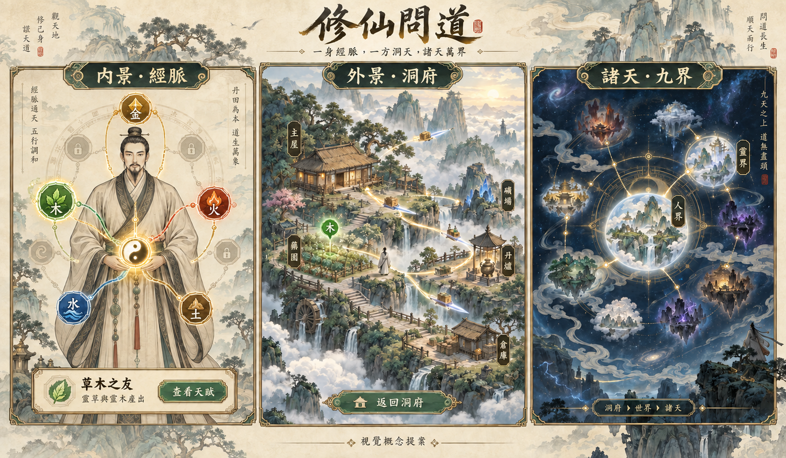

# 修仙問道 v2｜塔防圖譜承接與具體視覺設計

版本：0.1 · 2026-09-13 · 視覺與玩法整合提案

**建議以工筆人物古卷為主要美術語言，將五行天賦樹轉譯為「內景經脈」，再讓同一種靈光流動延伸到洞府、護山陣與諸天世界。** 先讓既有修仙功法與天賦可以被看見，塔防戰鬥作後續獨立支線評估。

## 1. 這兩張參考各自提供什麼

| 參考 | 值得承接 | 需要調整 |
| --- | --- | --- |
| [五行經脈畫面](E:/WORK/GodTower/Sample/codex/exec-2bacb311-34ff-4d74-a1cf-1bba5970b822.png) | 五行印章、太極中心、前置连線、選中節點與詳情分區，一眼可見修行方向 | 像素厚邊框佔空間；右側卡片加底部大升級按鈕有重複操作；橫式布局不能直接縮成手機直式；生命恢復、天賦點與數值都不能當修仙規則 |
| [工筆人物圖譜](E:/WORK/GodTower/assets/ui/talent-atlas-figures-v1.png) | 正背面人物、布料與佩玉、古卷紙感、留白、細線墨色，非常適合內視與功法頁 | 這是有背景的雙人物整張圖，不能直接當透明角色或完整動畫；互動節點、衣袖動態與紙張需分層 |

採第二張的線條、人物與材質作主風格，將第一張的節點可讀性與五行識別重繪進來。青玉、赭金、朱砂保留，邊框改細，裝飾讓位給人物和狀態。洞府仍有雲氣與山水深度，避免整款遊戲都變成一張泛黃管理表。

本次概念圖示意三個尺度，不代表已完成引擎畫面；正式文字、按鈕和資料都應由 Godot UI 繪製。

已完成 [三尺度概念板 v2](visual-concepts/meridian-world-v2.png) 與 [完整生成／修訂提示詞](visual-concepts/meridian-world-v1.prompt.md)，使用內建 image_gen。已檢視人物、五行識別、三尺度一致性及草木之友的天賦標示；這是構圖與風格驗證，未做引擎效能或触控驗證。

## 2. 已核對的 GodTower 資產與程式

本次唯讀檢視使用者指定圖像及相關天賦程式；未執行、修改或搬動塔防專案。舊文件中的開發環境敘述不當作目前工具能力，附圖中的數值也不作規則指令。

| 來源 | 已存在的內容 | v2 承接方式 |
| --- | --- | --- |
| [talent.ts](E:/WORK/GodTower/src/talent.ts:16) | 穩定天賦 ID、分類、前置、等級、古典名與白話機制副標、visualTheme | 借用資料與呈現分開的結構；保留修仙自身 ID／價格／效果，建立明確映射 |
| [talentConnections.ts](E:/WORK/GodTower/src/ui/talentConnections.ts:10) | meridian／branch／convergence／outer 連線種類，locked／available／active／maxed 狀態 | 轉成 Godot 資料與曲線呈現，沿用狀態語意而非直接移植 DOM／SVG |
| [talentConnections.ts](E:/WORK/GodTower/src/ui/talentConnections.ts:53) | 真正前置由 TALENT_TREE 推導；五個 outer seal 是永久未開放装飾 | 修仙圖譜也區分功能與裝飾；外章不能直接冒充可玩的九界 |
| [talentConnections.test.ts](E:/WORK/GodTower/src/__tests__/talentConnections.test.ts:23) | 前置一致性、外章鎖定、連線狀態、陰陽匯流案例 | 作 Godot 對應驗收情境；本輪未重跑測試 |
| [index.html](E:/WORK/GodTower/index.html:1634) | 引用人物圖譜圖片 | 已有使用入口，仍需為新布局處理人物與背景分層 |
| [visualRefresh.css](E:/WORK/GodTower/src/ui/visualRefresh.css:2441) | 主題色、墨線／光暈／流動層與不同節點狀態 | 取視覺規則重新實作，CSS 不直接適用於 Godot |

截圖不是目前 runtime 的完整證據。例如圖中「木靈初醒、生命恢復+5%、等級1/3」與天賦原碼的「肝木疏達、木系傷害、最高5級」並不相同。這次採它的視覺構成，機制以修仙來源為準。

## 3. 如何併入修仙玩法

### 3.1 第一階段：同一套玩法的圖譜入口

圖譜提供「功法」「輪迴天賦」「五行總覽」視圖。每個可操作節點綁定一個既有功法或天賦 ID，詳情仍顯示原本需求與消耗。五行總覽先是篩選和效果摘要，不新增一種天賦點或獨立升級成本。

| 塔防內容 | 修仙轉譯 | 初期處理 |
| --- | --- | --- |
| 堡壘生命、固關 | 容量、洞府根基與穩定供給的視覺意象 | 綁定已存在的容量／建築相關效果，不新增基地HP |
| 開局金幣、任脈養元 | 輪迴後的資源傳承 | 對應原作傳承規則，不沿用塔防金幣數值 |
| 木系覺醒 | 靈草、靈木與生機 | 可將既有「草木之友」天賦歸入木主題，效果只計算一次 |
| 火系強化 | 丹爐、炼製與丹火意象 | 先以可核對的配方／效果作視覺分類；新增煉丹速度效果另提案 |
| 土系築垣 | 倉儲、洞府建築、護山陣 | 先對應容量或建築效率；護山陣屬後續玩法 |
| 金系鏡刃 | 飛劍、金石與功法意象 | 不把塔傷害直接當修煉增益；建立已存在效果的明確映射 |
| 水系藏精 | 吐納、循環與蘊養意象 | 先作修煉相關內容分類，避免默加生命恢復機制 |
| 陰陽合流／太極 | 高階功法、輪迴或世界法則的匯流視覺 | 只有真實雙前置存在時才畫可解鎖合流線 |

經脈頁與原天賦面板指向同一個 Command 和狀態。若購買「草木之友」，實際消耗仍由原作道心規則決定；不得額外再給「木靈初醒」同款加成，造成圖譜和天賦重複計算。

五行象徵線是美術語彙，實際前置線是規則。相生環可以作低對比裝飾，但不得讓玩家以為必須沿環依序購買所有節點。首版不引入新的五行相剋倍率。

### 3.2 第二階段：經脈配置與世界共鳴

待現有功法／天賦視圖驗證後，再評估有限「運轉位置」：學會的內容仍保留，只有裝配中的新共鳴效果作用於探索或洞府配置。這是新玩法，需要獨立 rules_version，不能追溯改變舊版已學功法的永久效果。

示例提案：木路共鳴讓玩家偏向藥圃供給；火路共鳴偏向丹爐；選擇會改變一個明確目標並付出位置成本。九界提供不同環境條件，讓同一套配置在不同世界有取捨。尚未定案的數值不寫入原作平衡表。

### 3.3 塔防玩法的落點：護山陣試煉

最適合的敘事是「洞府建立根基後，以陣眼、飛劍和靈獸守護靈脈」。塔位轉成陣眼，敵人路線轉成入侵山徑，五行塔轉成劍陣、藤陣、丹火、玄冰與土障；原有迷宮尋路、波次和攻擊系統需另評估移植，圖譜搬過來不等於戰鬥也已搬過來。

建議先作可選、短時、有固定場景的護山試煉：事前配置 → 自動戰鬥 → 結算 → 回到洞府。關閉頁面暫停試煉或按明確策略結算，不在玩家離線時反覆襲擊並摧毀日常收益。普通升境、原版渡劫與護山試煉是三種不同事件，不強迫塔防通關才可修仙進度。

首個試煉原型只驗證三個陣眼、一條路線、三波入侵與一次結算；數量為提案。初期獎勵可採首次完成圖鑑／外觀，避免新增可無限刷的核心成長貨幣。若後續加入材料，先驗證產出上限、替代取得路徑與離線玩家的公平進度。此支線排在 M3 代表性多世循環之後，不擴張目前 M2 範圍。

## 4. 三個尺度的具體畫面

### 內景：一身經脈

主視覺是單一正面修士與細線經脈，丹田為低亮度中心。五行節點安排在身體兩側安全區，連線穿過衣袍但不遮臉；選中的一路提高亮度，其餘保持可讀。背面以獨立切換顯示，使用正／背兩份固定構圖，不把兩張參考假装成360度旋轉角色。

手機直式：上方標題、視圖切換和真實可用資源；中間單人經脈；底部節點詳情抽屜。主要操作只有一個，依狀態顯示學習／升級／查看條件。正背面互切不改人物狀態，抽屜不遮當前節點。桌面才可展開側邊詳情，不直接把橫式畫面等比例縮小。

### 外景：一方洞天

鏡頭從人物丹田的金色圓紋淡出到洞府聚靈陣，再露出藥圃、林場、丹爐與山谷。人體內的細光線變成地表靈脈；木主題的節點色在藥圃、相關功法詳情與資源來源提示中保持一致。

選中木路後可點「查看影響」，高亮相關建築並顯示核心計算的前後差異。這是連接修行與經營的可操作功能，並非只是兩張同色背景。返回洞府时沿用原鏡頭位置和選中設施。

### 諸天：九界與宇宙

聚靈陣環形構圖再轉成世界的天幕邊界，山谷縮成世界上的一個光點；多個世界聚合為星域。白天紙金逐步過渡到青黛夜色，人物和建築消退，留下玩家實際擁有的具名據點。

五行仍表示功法／資源特性，九界表示環境法則；兩套 ID 和標記不可混用。九界總覽只按既定 RealmProfile 分組世界，不因為參考有五個外章印記就改寫成五個世界。永遠保留返回洞府與位置麵包屑。

## 5. 視覺語言與動效分鏡

色票是本次提案：紙色 `#E9DCC0`、墨色 `#302B27`、古金 `#B7924B`、木 `#3E7548`、火 `#A44232`、土 `#8B6727`、金 `#727B83`、水 `#315F78`、宇宙底色 `#111E2B`。五行色搭配字形／圖示／線型，不只靠顏色辨識。金系冷金屬與通用古金選中框要能區分。

| 狀態／事件 | 圖像變化 | 動態提案 | 可讀性與低特效替代 |
| --- | --- | --- | --- |
| 已鎖定 | 灰墨印章、細虛線、鎖定原因 | 靜止 | 保留文字原因；裝飾節點標未開放 |
| 可學習 | 細古金邊、節點本色 | 2.5–3秒輕呼吸一次 | 低特效只保留邊框 |
| 已學習 | 實色印章、穩定實線 | 少量光點沿有方向的路線流動 | 低特效實線＋等級即可 |
| 選中 | 外環提高對比，詳情卡對位 | 約150ms亮起 | 不放大到壓住鄰近節點 |
| 升級成功 | 原節點亮起，新等級顯示 | 0–150ms按壓回饋；150–500ms光流匯入；500–900ms印章定色 | 指令先提交，演出可跳過，不用回調發獎勵 |
| 資源不足 | 保持節點位置，標記缺少資源 | 約120ms輕提示 | 不做紅色全屏闪爍 |
| 功法效果作用洞府 | 關聯建築出現同色描邊 | 300–600ms導引光線 | 顯示「影響哪些產線」文字清單 |
| 內景→洞府 | 丹田圓紋對位聚靈陣 | 約700–1000ms遮罩過渡 | 減少動態改為短淡入 |
| 世界→星域 | 據點縮成光點並保留名稱 | 約900–1200ms層級過渡 | 保留位置與返回入口 |

所有時間為視覺提案，需在真實手機調整。持續小回饋保持安靜，渡劫才使用更強的光、聲與鏡頭；不能每次點天賦都演成渡劫。

## 6. Godot 資產與模組落地

建立 `MeridianAtlasView` 讀取功法／天賦 ViewModel，`MeridianLayout` 定義正背面錨點，`MeridianConnectionView` 畫前置與效果連線，`NodeDetailDrawer` 顯示成本與效果，`EffectDirector` 只負責演出。規則仍經既有 `LearnSkill`／對應天賦指令執行。

每個節點至少有 `node_id / binding_kind / binding_id / theme / front_anchor / back_anchor / presentation_only`；binding_kind 清楚區分 skill、talent、summary。summary 只導覽不花費；presentation_only 的裝飾不能接入學習命令。外觀 theme 改變不改規則 ID。

成本與已學狀態由核心回傳，precondition graph 由真實定義產生。人體、地表與宇宙共用配色和光流手法，但分別渲染修行前置、產出關係、世界航路，不能拿同一張圖直接代表三種業務關係。

| 要製作的資產 | 建議交付 | 品質條件 |
| --- | --- | --- |
| 人物正背面 | 分開透明 PNG、獨立衣袖／腰帶／佩玉遮罩 | 同尺度與基準點；原雙人古卷不能直接充當這些分層 |
| 紙張與邊框 | 無人物背景、可伸縮邊框、獨立角飾 | 文字區紋理淡，窄螢幕不被厚框吃掉 |
| 五行印章 | 統一外徑與安全內框、字與圖案可分離 | 小尺寸可識別；鎖定／選中以引擎狀態疊加 |
| 經脈 | 各布局錨點與曲線資料 | 不烘焙成整張圖，縮放和點選一致 |
| 洞府相關建築 | 藥圃／林場／丹爐／聚靈陣分層 | 白天、選中、停機以有限變體或遮罩處理 |
| 諸天背景 | 星霧／遠景世界／前景節點分層 | 裝飾星點不建立經濟實體 |
| 音效 | 低音量紙張、印章、清磬與氣流 | 可獨立關閉，重複操作不堆疊爆音 |

Godot 實作可先採普通2D曲線、光暈貼圖、少量粒子與遮罩。是否使用更昂貴的後處理要由目標匯出測試決定，不預設每個節點都需要燈光或獨立視口。

## 7. 對既有里程碑的增補

- **M0 美術探針**：一個人物構圖、五個摘要印章、一个綁定既有天賦的節點，測繁體字、曲線命中區、低特效。
- **M2 內外景示範**：點草木相關節點→查看原效果／需求→切回洞府高亮受影響產線。只讀摘要與真正購買狀態分開驗收。
- **M3 圖譜完整性**：既有功法／天賦分類、輪迴前後保留一致、正背面布局。護山試煉另列探索任務，不是完成M3的前置。
- **M4 跨界**：一個已學效果在兩界的影響摘要、世界返回路徑、經脈與航路的視覺對應。

驗收重點：只購買一次且不重複加成；線與真實前置一致；未開放外章無互動假象；360CSS像素寬可讀；降特效不影響數值；切視角不再建新存檔或核心狀態。原圖只有正背兩面，不能把「360度人物」或完成動畫列為已交付。

本次只更新規劃與概念資產，不把塔防點數、HP、波次或存檔直接匯入修仙。若採用護山試煉，需另定戰鬥規則、獎勵與專用測試。
