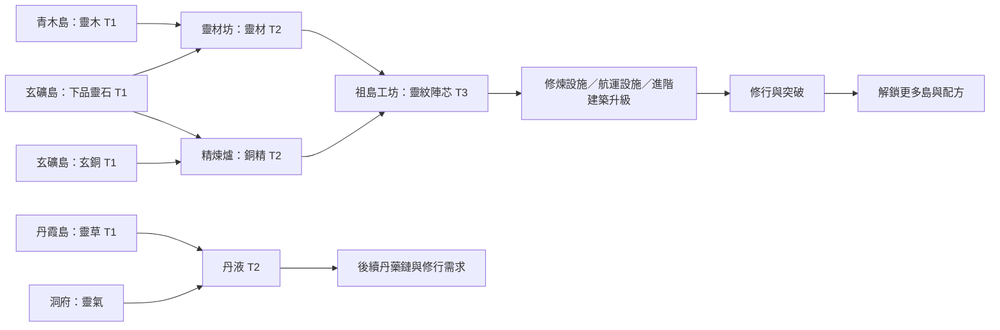

# Era、多島產業與多階資源主線

2026-10-08 **RES1-UI1-A DONE（有界呈現階段）**：空島基本操作／集中製造正式接入Godot；八配方四產線、啟用／開拓／加工坊／模式／切方／停工與煉丹同工作有命令證據。全量55及最後127專項、世界59／26、桌面Web子範圍通過。經濟配方／產地／運輸成本不變；下一UI1-B航線精簡、UI1-C完整Web／裝置／性能與人工驗收。[驗收](verification/res1-ui1-a.md)。

2026-10-08 **RES1-UI1-DESIGN**：多空島操作依[精簡計畫](16-multi-island-ui-simplification-plan.md)改為島上基本操作／集中製造／集中運輸的設計方向，覆蓋下方§6全部操作放同島詳情的舊配置。地方庫存、配方歸屬、每島單產線與固定航線不變；本輪僅設計與示意，正式接線待UI1-A/B/C，原RES1驗收門檻保留。

2026-10-05 RES1-D2：正常規則／管理接入金丹與丹霞，使用者核定Era＋設施門檻／新築基靈池；215 checks／52/52、最後UI87及桌面1280×720.4／短橫844×390滑鼠與重載有界通過。丹霞唯一加工丹液、成品回運／祖島T3與修行需求及舊C歸檔接續已交付，专用丹霞世界美術與完整Web新檔／人工／裝置／C/R2仍待驗。D2／完整D IN_PROGRESS。[D2驗收](verification/res1-d2.md)／[ADR-011](decisions/ADR-011-era3-capacity-and-skill-gates.md)。下方較早狀態保留日期。

2026-10-04 RES1-C3 最新：三島為築基首段切片，長期30+容量方向／36島草案與有限材料共用見[新規格](15-island-expansion-and-art-direction.md)。四張PNG已接正常版「經營→空島」，玩家保留原檔啟用；50/50、world22與兩版型Web操作通過，[C3](verification/res1-c3-art-integration.md)。後續島群尚未實作，C/C3人工美術／節奏與C2效能／裝置仍待驗；此前正式未附掛／先效能順序由本輪要求覆蓋，保留歷史結果。

2026-10-04 RES1-C2-R1 最新：[收尾驗收](verification/res1-c2-closure.md) 補桌面async保存追加矩陣146 checks、全量50/50及world15 checks；效能實測未達預算（桌面48.60FPS／p95 33.4ms、20Mbps／100ms含48h恢復67.84秒、gzip估算44.72MB）。使用者美術／節奏明確保留待驗，實機／高DPR等另待補；整體C2仍IN_PROGRESS，下一C2-PERF、不跳D。正式manifest未附掛，原C1／C2雙鏈T2／48h拒寫重試與歷史規格保留。

2026-10-03 最新：B核心／桌面Web相交範圍DONE；**C整體IN_PROGRESS，C1階段已交付**。三島設施／T2真實消耗與隔離Godot操作、87 checks／最終49Runner及兩版型Web證據見 [C1驗收](verification/res1-c1.md)。下一C2補世界／長離線效能／完整玩法矩陣；正式manifest仍未附掛。下方B IN_PROGRESS／「下一故障矩陣」是較早历史，不重做已交付B。

2026-10-03 · RES1-DESIGN DONE；後續 RES1-A 首批內容契約／隔離核心 DONE，見 [驗收](verification/res1-a.md)。RES1-B 核心／CLI 已交付（251 checks、native 三程序保存／離線），整體 IN_PROGRESS，見 [B 驗收](verification/res1-b.md)；Web 保存門檻及正式多島玩法仍待 B–D；下文工作方案不等同已上線。

依使用者當次要求：Era 提升逐步解鎖空島；各島有資源職能、設施升級、加工融合及彼此供給／運輸；高階資源支撐後續建設與修行。這是主成長循環，優先於擴充更多沒有產業用途的九界入口。下文島名、解鎖分段、配比／耗時是工作設計，不能當作已平衡或 DAO1 原規則。任務順序以 [Roadmap](../ROADMAP.md) 為準。

## 1. 方向與舊決策的修正

玩家每次突破應得到一段可理解的新產業：看見新島與原料 → 開拓／建設 → 解決採集、加工、倉儲或運輸瓶頸 → 做出新材料 → 升級既有產業與修行設施 → 支撐下一次突破。低階原料持續進入高階配方，舊島不因升境就失去用途。

| 概念 | 新規劃責任 |
| --- | --- |
| Era／修行境界（使用者稱 EAR） | 角色進度與解鎖門檻；每境內仍有等級，不把每級當一座新島 |
| 空島／據點 | 具名產地與加工場所，有穩定 island_id、設施、庫存和航線；Era 解鎖一個或一組島，可在同一境界繼續升級 |
| 資源階層 T1／T2／T3 | 原料、加工材料、再加工材料；由配方依賴界定，不等同 CSV 的 basic／advance／crafted，也不等同 Era |
| 九界／realm_id | 生態與法則環境；人界可包含多島，不要求解鎖第二島就跨去靈界 |
| 地圖縮放 | 同一份經濟的視圖；鏡頭和動畫不發放收益 |

「不把十座地塊硬塞目前島圖」仍有效；「因此只做單島清單、物流一直是裝飾」不再作為目標。主島保留修行與祖業，各專業島承載代表建築；管理清單是同一批設施的便捷入口。

## 2. 實作落差與承接基線

本輪唯讀 CSV 清點：DAO1 有 61 個非空資源 ID（12 basic／19 advance／30 crafted），30 個配方、49 個 buildings.csv 建築記錄、10 個 storage.csv 記錄、12 境界。DAO2 manifest 載入 7 資源／10 建築／Era 1–2；另有 AlchemySystem 三種丹藥及 RealmSystem 靈晶／靈液等獨立定義，不能把 manifest 計數當全遊戲計數或完成百分比。

DAO1 已有配方與前置技能、容量、合成加成／暴擊規則；DAO2 現有少數煉丹命令不代表已移植這套資源加工體系。尤其缺口從 Era 2–3 就開始，不能只列「Era 9–12 待补」。完整清點、來源 hash、範例和限制見 [RES1 稽核](verification/resource-progression-audit.md)與其 JSON 證據。

三類資料分開追蹤：

- **DAO1 對照基線**：先固定舊 ID、配方、來源、用途、技能與境界門檻，保留 fixture；有同名不代表同規則。
- **v2 明確變更**：島嶼歸屬、加工時間／自動化、物流、靈材與陣芯等新配方、新升級材料需求；寫差異與規則版本。
- **未完成內容**：有資料／按鈕／測試名稱也不能標為完整承接；必須走過獲取→加工→消耗→保存／輪迴。

## 3. 首段 Era 與空島分工

以下是首段工作方案。先完成 Era 1–3 的可玩鏈，再為 Era 4–12 逐段移植來源；沒有預先新增十二個空殼場景。

| 階段 | 可操作島與設施 | 產業變化／具體用途 |
| --- | --- | --- |
| Era 1 練氣 | 祖基洞府；既有茅屋、初階林場／礦場／藥圃；祖島工坊作加工入口 | 維持基本起手與首升境路徑；展示下階島的用途／條件，不要求尚未解鎖島的產物才能築基 |
| Era 2 築基 | 開拓青木島與玄礦島（暫名）；林場、靈材坊；礦場、精煉爐；各有小碼頭／倉儲地標 | 原料專業化、靈材／銅精 T2、第一條常駐運輸；投資產能、運力、倉儲或加工速度，獲得不同改善 |
| Era 3 金丹 | 開拓丹霞島（暫名）；靈植園／丹液坊；祖島工坊開啟陣芯融合 | 百年靈草／中品靈石／金丹等 DAO1 支線按依賴接回；T2 材料融合為 T3 陣芯，用於高階設施與修行效率 |
| Era 4–6 | 按 DAO1 秘銀、寒鐵、千年靈草、虛空精華等来源與用途設計後續島組 | 增加互相依賴的產地／配方與修行消耗；核對技能與丹方門檻後才實作，不能只加全域倍率 |
| Era 7–12 | 按星辰金屬、虛空晶、仙晶／神金及高階丹藥鏈分段擴展 | 每階都要有來源、運輸、配方、消耗、保存／輪迴證據；詳表留後續契約任務 |

解鎖分「看得到」「符合 Era」「已開拓／有產能」三態。符合 Era 是新機會，玩家仍要投入當時已可取得的材料建立產業。第一艘運輸／第一個工坊不能要求它自己才會生產的材料。首島碼頭與基礎運力須能用祖島既有 T1 資源建成。

主島既有產業與等級保留，提供最低自救供給；新專業岛提供更高效率、專用配方與擴充空間。舊建築和新設施各有唯一生產者 ID；不得將同一舊建築同時在祖島與遠島結算。遷移既有建築歸屬若有需要另立明確映射，首版不自動搬走玩家祖業。

## 4. 資源链與用途

下列是**無正式配比／耗時的結構示例**。顯示名與 ID 經 RES1-A 收斂後納入 manifest，不從此圖直接生成價格。

靈木＋靈石→靈材、靈材＋銅精→靈紋陣芯是 v2 新內容；玄銅＋下品靈石→銅精、靈草＋靈氣→丹液有 DAO1 配方來源。DAO1 的金丹配方已使用築基丹與中品靈石，能展示合成物再次作原料的既有鏈。物料不是單純換圖示：至少有下列用途。

| 物料 | 首段用途（工作方案） | 不能省略的驗收 |
| --- | --- | --- |
| 靈材 T2 | 專業島倉儲／碼頭擴充、工坊升級 | 消耗後能看見實際容量／吞吐改善；不是只有解鎖一次 |
| 銅精 T2 | 精煉爐／運輸設施升級、陣芯輸入 | 玩家可選擇先擴產或先保留材料做陣芯 |
| 靈紋陣芯 T3 | 修煉設施與進階產業升級 | 實際影響下一段修行或產線效率；有可重複的合理消耗 |
| 丹液／中品靈石／高階丹藥 | 按 DAO1 資源、配方、技能和 Era 消耗逐項承接 | 新增資源必须有來源與消耗，不能做出後只停在庫存 |

升境保留「容量條件」與「庫存扣料」的區別。新材料可先用於升級提高容量／修煉效率的設施，以及有來源的境內晉階消耗；如改為突破直接繳交材料，必須是單獨 v2 規則變更。不能用 Era 3 才可取得的材料阻擋 Era 2→3。

## 5. 加工與運輸規則工作方案

### 加工

配方資料包含原料、產物、所需 Era／技能／設施、批次時間、配方版本。首段提供單次／指定批數／重複製作與原料保留量，避免每批都要玩家點擊；工坊升级改善速度或解鎖配方，額外加工槽位稍後按需要開放。

啟動批次時原子扣原料並保留產物空間；原料不足或無產物空間時不開新批。進行中的工作保存剩餘整數時間；停止／切配方在本批結束後生效，避免退料與重送套利。完成由核心時間事件入庫；動畫只是呈現。工業材料初版採確定產量，DAO1 合成暴擊／技能加成保留為對照，如何承接丹藥與法器須在 RES1-A 明確記錄，不能把當前簡化 AlchemySystem 當原版。

### 庫存與航線

採用**地方庫存＋祖島倉庫＋在途貨物**。全域資源清單是總覽；「全世界共有」不等於當前工坊「可用」。木／石／金屬／加工物需要抵達消費地才可加工；金錢與角色靈氣首段維持全域資源，不要求它們也搭船。

初期提供明確的固定航線、預設自動搬運與少量優先設定，玩家不需畫任意交通網或逐趟派遣。青木島↔玄礦島交換靈木／靈石，兩島向祖島供應加工物；每條航線說明貨種、來源保留量、目標庫存、運載量与週期。依核心模擬輸出實際在途動畫。

- 吞吐同時受每趟載量、往返週期、原料供應與接收空間限制；升級運力必须改善實際到貨速度。
- 出航扣來源庫存，貨物轉入在途記錄；出航前保留接收空間，到達後移入目的庫存。狀態總量守恆，不在兩地同時可花；容量保留不允許被其他加工／航線重複占用。
- 目標滿倉時停止新出航；在途貨物不丟失。改航線／停用在當趟完成後生效；固定穩定順序處理同刻到貨／完工／新啟動。
- 不另加運輸損耗、隨機劫掠或必須在線救援；首段策略集中於「採集、加工、物流、倉儲哪個是瓶頸」。
- 建造與升級的工程費首段從祖島可用倉庫支付，明示此簡化；本地加工原料照實際航運供給。遠島餘貨不能隔空支付祖島費用。

物流瓶頸例（驗收用假設數值，非平衡定價）：某產地每秒採 2、航線每秒只運 1，來源庫存堆積而祖島收到 1；此時再升採集無法加快到貨，提高運力才有效。加工缺料、產物滿倉也需有同樣可解釋的案例。

## 6. 看得懂的場景與操作

- 切島時有短 Banner：「人界・青木島」「林業／靈材加工」，隨後保留目前島名與返回祖島入口；不擋操作。遠景牌顯示島名、主產物、運轉／缺料／滿倉／運力不足或開拓條件。
- 島體剪影、色調與代表地標要不同：青木林場、玄礦礦坑與熔爐、丹霞藥圃；每島只放有地基／透視／命中的少量關鍵建築，同一 Godot 世界／場景體系呈現。其餘設施可從島詳情管理。
- 所有標為「可進入」的島都能點擊进入同一 canonical route。背景裝飾不使用可操作名稱與金色入口樣式；先修掉現行「跨界神遊」文字可見但點擊仍回未開放的落差。
- 點資源能查「哪裡生產／用於哪些配方／誰在消耗／如何補缺口」；配方卡顯示每批投入、時間、產物、可用／在途／保留量、下一步缺什麼。
- 底部仍為洞府／經營／修行／遊歷。「經營→洞天據點」擴為島嶼總覽、島詳情、加工與航線的同頁子視圖；既有建築頁可依島篩選。煉丹與材料加工共用配方／庫存核心，入口按使用上下文導向同一工作記錄。
- 桌面與短橫向均按 docs/07；不要在每島堆一大段常駐 Banner。最小字級、底板、選取與 HUD 避讓要一起驗。

## 7. 現有系統、存檔與確定性

保持 GameSession／CommandProcessor／AmountCompat／TimeAdvancer 架構。新增島、配方、航線資料與必要的加工／運輸狀態，不建立另一份獨立存檔或讓 Node 持有經濟。現有 RealmSystem 三設施是**靈界的一個產業群**，不直接假定它們就是三座空島；往後映射到實際靈界據點，等級與庫存需保存。人界島嶼解鎖以當世 Era 為門檻；既有輪迴解鎖靈界規則另存，不能無意解開全部人界產業。

目前 TimeAdvancer 的固定產率整段合併不能直接套多階加工與貨運：需在缺料／容量／到貨／完工／BUFF／天時／壽盡邊界分段，確認 600 秒一次與分段推進等價。首段用受限的固定鏈與有界航線，不先建通用物流腳本引擎。

遷移必須以新 schema／rules／content 版本承載：舊中央庫存全部映射祖島且只映射一次；新島採未開拓狀態，既有建築和靈界進度不重建／重扣。foundation_pill 目前在 resources／pills 雙處表示，靈晶／靈液仍為 realm float，必須先定單一權威庫存与 Amount 支援邊界，再讓新配方消耗；禁止從兩個位置同時扣除或加總成兩份。

保存包括工作剩餘時間、在途載貨／到達時間、已保留容量、命令收據與結算游標。保存失败重試不再扣料／發貨／完工；损壞回上一世代。新版本先輸出遷移預覽、保留可回復原檔，未知配方／航線版本拒絕或明確復原，不能默默丟貨。

輪迴工作預設：當世島開拓、設施、庫存、加工與在途貨物按既有當世重置規則清除，發現圖鑑／配方知識可保留作提示但仍受當世 Era 使用門檻。既有資源繼承天賦須只對合法資產結算一次，庫存、在途、預留原料不得重複繼承。具體承接表與玩家預覽列 RES1-B 驗收；本輪不改現行輪迴。

## 8. 交付順序與放行

| 任務 | 交付 | 完成證據 |
| --- | --- | --- |
| RES1-DESIGN | 本規格、來源稽核、ADR 與 Roadmap 修訂 | 本輪文件／JSON／來源 hash／連結檢查；僅設計 DONE |
| RES1-A | Era 1–3 資源／配方／技能／設施／消耗依賴契約，首批通用加工命令與統一庫存讀取 | 至少銅精、丹液、中品靈石、築基丹→金丹來源鏈；靈材／陣芯 v2 配方；成功／拒絕／冪等、Amount、解鎖與無死鎖；新丹藥政策与舊 fixture 分開 |
| RES1-B | 加工時間、地方庫存、固定航線、版本遷移與離線 | 缺料／滿倉不丟料、流量與守恆、一次／分段一致、保存中斷／重試／輪迴；與 M1-C/D 相交部分補齊後才接正式存檔 |
| RES1-C | Era 2 三島切片：祖島＋青木＋玄礦，T1→T2、生產者和物流的可見操作 | 空白檔可達、三島身份／點擊、一次物流瓶頸與解法、T2 真正被升級消耗；1280×720／844×390 Web 實際操作 |
| RES1-D | Era 3 丹霞島與 T2→T3、修行／建築需求閉環 | 無 Debug 完成首段多島產業循環；至少一次「擴產或先修行」取捨、重開和離線一致；使用者確認玩法與辨識度 |
| RES1-E | Era 4–12 分段承接，與宗門／靈獸／九界整合 | 每段列所有資源的來源／配方／用途／存檔／輪迴，沒有完整證據的格子保留 TODO；先驗手工產業再增加生成量 |

RES1-A 首批契約／隔離核心及 RES1-B 核心／CLI 已交付，下一項是 RES1-B／M1-C/D Web 故障矩陣。RES1-DESIGN 不算資源玩法已上線；整體 RES1 必須通過 A–D 才能稱首段多島加工運輸可玩，DAO1 全量承接另看 E 的逐項矩陣。M1-C/D 的可靠保存仍是新經濟正式放行的必要條件，其他未完成 UI／實機缺口保留。

## 9. 參考來源的使用範圍

- [Idle Planet Miner 開發者商店介紹](https://play.google.com/store/apps/details?id=com.TironiumTech.IdlePlanetMiner)：採礦行星升級、熔煉與製造提高資源價值。多島物流需求以本次使用者明確要求為準，不由其商店文案推定精確運輸公式。
- [Kittens Game 資源說明](https://wiki.kittensgame.com/en/general-information/resources)：原料與加工物形成後續建築／科技需求，取其多階依賴和舊資源持續有用的原則。
- [Evolve 作者資源程式](https://github.com/pmotschmann/Evolve/blob/master/src/resources.js)：craftCost 與手動／自動加工加成展示材料加工及後期用途。數值與實作不直接複製。
- DAO1 本機 CSV、ResourceManager 與純規則是承接依據；現存初期文件曾將物流收斂為純呈現，本輪依使用者要求由 [ADR-009](decisions/ADR-009-multi-island-resource-economy.md) 修訂。
