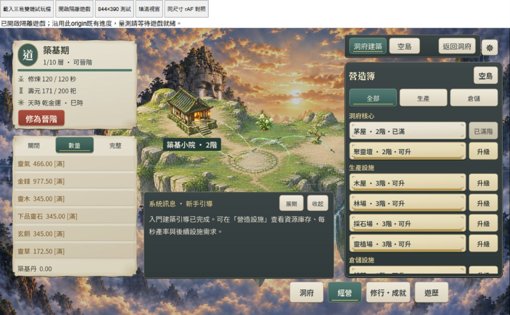

# RES1-C2-PERF-R2｜HUD 重複刷新優化

2026-10-04。使用者要求「HUD 優化，仍不進 D」。本輪 HUD 子階段交付；**R2／C／C2 IN_PROGRESS、D TODO**。未改收益、保存版本、命令保存頻率或 FPS 門檻。

## 交付

- `feature_navigation.gd`：HUD 將當輪 View 傳入 layout；其他切頁／resize 使用既有 GameState 身分＋revision 保護的 `_presentation_view()`，避免導覽每次重新 `session.get_view()`。主入口樣式只在選中狀態變更時套用。
- `abode_hud_controller.gd`：資源讀數延至導覽合併共享貨幣後一次繪製；無導覽的呼叫仍立即刷新。
- `building_catalog.gd`：獨立呼叫 refresh 保持立即顯示，HUD 路徑可延後資源卡更新；資源 entry／名稱／Era／模式／紙底狀態的副本判斷失效，避免原地修改造成舊顯示。滿倉與紙底樣式只在狀態改變時套用；建築按鈕與材料條避免重覆覆寫相同材質。沒有快取權威庫存或將 UI 快取写入存檔。
- `resource_feedback_runner.gd`：新增 14 項顯示回歸，總計 752 checks，涵蓋同一字典滿倉→扣料、數量／完整模式、Era 採集限制、資源可見性、共享獸魂消失、道心重現、debug 明確刷新、revision／state 替換與清除舊共享進度。

## 真實瀏覽器結果

Windows／IAB Chromium154，正常特效、祖島、資源數量模式、摘要已關閉、訊息維持開啟，Brotli 本機非節流；前後均由同一命令生成雙鏈 fixture 取得，但自然離線分別 66／12 秒，tick／天時／庫存隨時間演進。音樂維持預設，兩份 raw 均記錄原 MP3 01／02 外載；未確認可聽音訊或量測播放成本。沒有 Runner、匯出或壓縮與取樣並行。

設定瀏覽器 1280×790，launcher 工具列佔 70px；DOM iframe client 尺寸 1280×720，但因 fractional pixel／DPR 映射，遊戲 sample **inner viewport 是 1280×721／DPR 1.0000000149011612**。以 sample 實測記錄，不能稱嚴格 1280×720 遊戲像素配對。

| 非 profile 組別 | 三組 FPS | pooled FPS | p95 | 最長間隔 |
| --- | --- | ---: | --- | --- |
| 本轮修改前 | 59.4635／59.1968／59.7301 | 59.4635 | 全部16.8ms | 50.0ms |
| 本轮修改後 | 59.8639／59.0635／59.5972 | 59.5082 | 全部16.8ms | **183.4ms** |

前後取樣尺寸／DPR／fixture來源／HUD模式一致，但遊戲時間不同，沒有隨機交錯取樣、清除 WASM cache 或新的無遊戲對照。**不能將微小 pooled 差異宣稱為確定 FPS 改善；六組均未過嚴格60。** 183.4ms 发生在非 profile 第二組，沒有 CPU span，不歸因保存、GC或GPU。

修正後另外三組 CPU profile（不列 FPS gate），1280×721／DPR約1：

| 組別 | HUD平均 | 導覽平均 | 建築／資源清單平均 | 保存單次 |
| --- | ---: | ---: | ---: | ---: |
| 1 | 5.816ms | 0.220ms | 1.566ms | 21.3ms |
| 2 | 5.582ms | 0.227ms | 1.455ms | 19.2ms |
| 3 | 5.593ms | 0.212ms | 1.421ms | 18.2ms |

共56／56／57次HUD刷新；span均inclusive，不相加。[前輪診斷](res1-c2-perf-r2-profile.md)是1280×720、HUD12.7–12.8ms／導覽5.0–5.1ms／清單3.7–3.9ms。新診斷低於前輪，但本輪 profile 在實際升級木屋至3階、重新載入後取得，tick／庫存與前輪也不同；這是有界成本證據，**不是相同快照的精確 CPU 前後對照**。HUD資源繪製已移到navigation末端，所以清單細分邊界也有所改變；HUD total較可比較。未改保存，保存仍18.2–21.3ms，是後續待處理成本。

桌面真實滑鼠：數量→完整、經營、木屋2→3階升級、材料與容量讀數立即改變、滿倉顯色；重開遊戲看到已保存的新讀數且只結算新17秒，沒有重複原離線。844×390 DOM精確 iframe：資源模式、經營→修行、返回洞府、填滿視窗恢復。短橫向原有資源可用高度暫收行為保留，不把這次驗收稱為全部版型重新設計。兩次console warn/error快照空；未驗觸控、高DPR或手機GPU。

## 命令及結果

Godot `4.7.2.stable.official.ed1daf0bf` 已驗，既有模板／Compatibility／單執行緒保持。

```powershell
& ./tools/godot/4.7.2/Godot_v4.7.2-stable_win64_console.exe --version
powershell -NoProfile -ExecutionPolicy Bypass -File ./tools/run_all_runners.ps1
# 最終51/51，exit0；resource_feedback 752 checks、精確tick/font145、async27
& ./tools/godot/4.7.2/Godot_v4.7.2-stable_win64_console.exe --headless --path . --script res://tests/res1c2_world_runner.gd
# 26 checks，exit0；既有Font/CanvasItem/ObjectDB/resource退出診斷保留
& ./tools/godot/4.7.2/Godot_v4.7.2-stable_win64_console.exe --headless --path . --export-release Web build/web/index.html
# exit0；只重新匯出正常Web
& 'C:/Users/asus/.cache/codex-runtimes/codex-primary-runtime/dependencies/node/bin/node.exe' tools/prepare_web_compression.mjs build/web
# exit0，壓縮roundtrip／原MP3 companions；core br14,451,078 bytes
& ./tools/godot/4.7.2/Godot_v4.7.2-stable_win64_console.exe --headless --path . --script res://tools/res1c2_review_fixture.gd
# 前後各一次exit0，只重封測試UTC/save_id，command-earned state不變
```

Bundled Python 路徑是 `C:/Users/asus/.cache/codex-runtimes/codex-primary-runtime/dependencies/python/python.exe`：

```powershell
# 本輪修改前保留build/web-profile，hash對應上一輪final baseline
python tools/island_preview_server.py --port 4242 --profile-build --gzip --review-fixture --metrics-log res1-c2-hud-before-metrics.jsonl
# 修正後正常build，?metrics=1不啟用CPU；?profile=1只作診斷
python tools/island_preview_server.py --port 4243 --normal-build --gzip --review-fixture --metrics-log res1-c2-hud-after-metrics.jsonl
python tools/summarize_frame_metrics.py docs/verification/artifacts/res1-c2-hud-before-metrics.jsonl --output docs/verification/artifacts/res1-c2-hud-before-summary.json
python tools/summarize_frame_metrics.py docs/verification/artifacts/res1-c2-hud-fps-after-metrics.jsonl --output docs/verification/artifacts/res1-c2-hud-after-summary.json
python tools/summarize_runtime_profile.py docs/verification/artifacts/res1-c2-hud-after-metrics.jsonl --output docs/verification/artifacts/res1-c2-hud-profile-after-summary.json
git diff --check
# summaries三組有效／profile三組無drop，diff exit0
```

完整raw保留。`hud-fps-after-metrics.jsonl`只從完整after raw選出沒有runtimeProfile的原行，未重算或改寫指標，以免profile影響FPS判定。首輪沙箱NAV runner user://保存拒寫→Nil／程序停滯，已Ctrl-C停止，最終授權全量含NAV通過；日誌`hud-nav.log`保留。首輪沙箱4242服務印出啟動但瀏覽器timeout，已停止並授權loopback服務重跑成功；「印出URL」不算成功。fixture命令保留user://log拒寫診斷，fixture保真檢查仍PASS。負面JSON故障測試及既有退出診斷不當成零錯誤。

正常PCK SHA256 `355396258489166eaa60dd2b9748677b6a89922e52da53924491de2d8a284272`；修改前PCK `1e42e85d8bd54551583c1ccfb5cfd26fb4e48096d8a9c70937741cc1bed0f244`。WASM仍 `fc74679e3b97f76878947fcd4fbe1268cbfa6188182a2e33bbc3f5dc9bfa57d0`。沒有手改build、更新環境、commit、push或部署；保存故障全矩陣／20Mbps48h沒有新跑，前輪證據保留日期。Runner及review工具重生兩份隔離fixture，不觸碰玩家origin。

原始證據皆位於 `artifacts/res1-c2-hud-*`，包括all-runners／world／export／compression／fixture與失敗日誌、兩組FPS raw／summary、完整after raw／profile摘要及畫面。保留正常隔離試玩[4243](http://127.0.0.1:4243/launcher?metrics=1)，已有檔按開啟隔離遊戲，不覆寫。只關閉本輪4242基線服務，沒有中斷其他服務。




下一同R2：針對剩餘View建構與保存編碼／長幀收配對成本及精確狀態證據，維持原保存故障契約與60FPS門檻；手機／高DPR／自然背景凍結／跨瀏覽器／長期GPU與人工美術節奏待驗。依Context Guard停在本輪子階段，用New Chat續，不進D。
