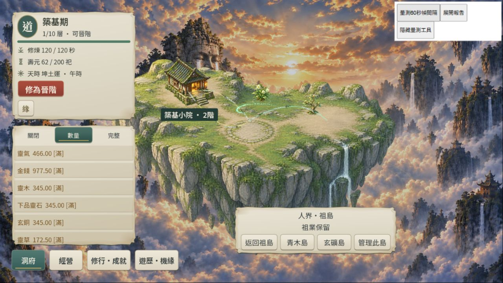

# RES1-C2-PERF-R2｜持續劣化定位：本輪未重現

2026-10-05（Asia/Taipei）。本輪正常版四組恢復 gate PASS；前輪 DPR1.25 的失敗仍未被同條件排除，當時沒有修復根因或完成 R2 的宣告。**後續（同日）已由 AGY 完成根因修復並 PASS，見[效能修復驗收](res1-c2-agy-r2.md)與 [ROADMAP／README／development-status 頂部]；本頁保留為修復前的定位歷史。**

## 重現條件與結果

沿用 4248 隔離 origin 的現有進度，沒有種檔／清除資料。此次顯示築基期、木屋2階，與前輪最後木屋3階不同；不能視為前輪同快照。首次摘要新增6秒，最後重載新增5秒。IAB Chromium154、頂層1280×720 CSS、**實測 DPR1.0000000149**，正常版、預設特效／數量模式、摘要关闭、報告收起、無 CPU profile。視口 override 將 DPR 改為約1，前輪實測1.25；未擅改系統縮放。結束已 reset override，分頁停 launcher 釋放 writer 鎖。

PCK SHA256 `134334491bd68be37fec0cdc292916c5f93020fae986e7ae3a6ecfec5e216eba`；WASM `fc74679e3b97f76878947fcd4fbe1268cbfa6188182a2e33bbc3f5dc9bfa57d0`，與前輪相同。未匯出或修改 Godot 來源／build。沒有清快取、独立聽音、冷啟動或精確前後配對。

| 觀測 | 秒 | FPS | p95 ms | max ms | 接近目標時間 | 末10秒恢复 |
| --- | ---: | ---: | ---: | ---: | ---: | --- |
| 正常首組 | 300 | 59.7436 | 16.9 | 183.4 | 100% | 是 |
| 同頁50次管理開關 | 300 | 59.5636 | 16.9 | 249.9 | 100% | 是 |
| 同頁延長 | 300 | 59.7436 | 16.9 | 216.7 | 98.3334% | 是 |
| 重載後 | 60 | 59.8468 | 16.9 | 33.5 | 100% | 是 |

全部 valid、visible、尺寸／DPR穩定，ADR-010 `desktopRecoveryGate=PASS`，僅涵蓋本輪四組。三個300秒樣本之間存在未取樣間隔，不宣稱無間斷15分鐘raw。延長組有一個5秒窗略低於55（約54.9959），之後恢復；不因單窗或249.9ms尖峰推翻恢復標準。沒有用空白對照替代遊戲。前輪54.740／48.088／35.105失敗保留。

管理操作先確認實際開啟／返回畫面，再做24組相同開關；合計25組、50次滑鼠操作，每次至少300ms轉換等待。管理開啟後底部導航會換位置，使用當輪畫面確認的管理／洞府兩位置。中段／末段PNG確認返回，沒有逐次收據或逐次截圖，不擴張為50次切島／觸控證據。遊戲與重載後兩份console warn/error皆空。沒有重做木屋升級或完整保存故障矩陣。

## 同期系統證據與可以排除的簡單解釋

新增唯讀工具 `sample_gpu_load.ps1`（僅GPU引擎利用率、ChatGPT程序PID／父PID／角色，不保存命令列）、`summarize_system_load.py` 與6項計算契約。另以 Get-Process 每5秒記錄程序累計CPU／私有記憶體／工作集／handles。CPU raw237筆，GPU raw150筆；CIM取樣有成本，GPU間隔約5秒加查詢時間，並非精密GPU profiler。

| 遊戲組 | 相交CPU間隔 | 系統CPU範圍 % | GPU 3D樣本數 | 共用GPU process 3D範圍 % |
| --- | ---: | ---: | ---: | ---: |
| 首300秒 | 61 | 20.58–27.75 | 39 | 27–32 |
| 操作300秒 | 61 | 20.26–30.92 | 54 | 9–32 |
| 延長300秒 | 60 | 19.40–26.69 | 48 | 28–32 |
| 重載60秒 | 13 | 19.73–25.98 | 0 | 未覆蓋 |

12邏輯核心；corePercent=100代表一個核心，整機百分比由可讀且前後都有的程序差分相加／12估算，可能漏新生／拒讀程序。GPU計數是單引擎快照，不能相加。PID14068被CIM確認為ChatGPT **gpu-process**，CPU約一個核心，並非可指派到遊戲的GDScript CPU。共用GPU process也服務其他app視圖，不能視為此分頁獨占負載；未量熱／頻率／逐幀GPU耗時。高負載時本輪仍近60，只能說該負載本身不足以解釋前輪持續失速。

本輪三組末端 `performance.memory.usedJSHeapSize` 約197.0／409.1／545.4 MiB，重載後約76.6 MiB，皆近60；前輪失敗重載後約65.5 MiB仍35.105 FPS。瀏覽器此計數不是精確的WASM／GPU／單分頁記憶體，也不是leak detector。某未唯一映射到分頁的renderer PID165528私有記憶體366.8→峰值1044.8→900.9 MiB（中途觀測），有回落。**記憶體大小與FPS並非單一對應**；不能據此排除GC／WASM／GPU資源洩漏，但不應把管理開关或heap增长直接當根因修。

## 命令與交付

專案PowerShell，Python／Node使用既有bundled runtime：

```powershell
& .\tools\godot\4.7.2\Godot_v4.7.2-stable_win64_console.exe --version
.\tools\sample_gpu_load.ps1 -Samples 150
# 同期另一程序：每5秒 Get-Process，取 Id/ProcessName/CPU/WorkingSet64/PrivateMemorySize64/Handles，寫JSONL。
python tools/test_system_load_summary.py
python tools/summarize_frame_metrics.py --self-test
node tools/test_frame_metrics.mjs
python tools/summarize_frame_metrics.py docs/verification/artifacts/res1-c2-degradation-metrics.jsonl --output docs/verification/artifacts/res1-c2-degradation-summary.json
python tools/summarize_system_load.py docs/verification/artifacts/res1-c2-degradation-system.jsonl docs/verification/artifacts/res1-c2-degradation-gpu.jsonl docs/verification/artifacts/res1-c2-degradation-metrics.jsonl --output docs/verification/artifacts/res1-c2-degradation-load-summary.json
git diff --check
```

Godot4.7.2版本exit0；6／16／13契約PASS exit0；PowerShell AST parse PASS；兩summary exit0、gate PASS。GPU採樣自然結束exit0；CPU採樣於觀測結束主動Ctrl+C exit1，237筆已寫入，非完成240筆。最初Get-NetTCPConnection因沙箱CIM拒讀exit1，改用授權唯讀採樣；兩次rg使用PowerShell不展開的glob路徑exit1，改目錄查詢。無新Godot來源／匯出／51 Runner；前輪51/51保持日期化證據。未commit／push／部署。4248既有服務會繼續追加舊 `res1-c2-recovery-metrics.jsonl`；本輪另保存獨立raw，未回滾服務新增紀錄。

證據：[raw](artifacts/res1-c2-degradation-metrics.jsonl)、[FPS summary](artifacts/res1-c2-degradation-summary.json)、[CPU raw](artifacts/res1-c2-degradation-system.jsonl)、[GPU raw](artifacts/res1-c2-degradation-gpu.jsonl)、[load summary](artifacts/res1-c2-degradation-load-summary.json)、[checks](artifacts/res1-c2-degradation-checks.log)、[FPS命令輸出](artifacts/res1-c2-degradation-summary-command.log)、[load命令輸出](artifacts/res1-c2-degradation-load-command.log)、[遊戲console](artifacts/res1-c2-degradation-console.json)、[重載console](artifacts/res1-c2-degradation-reload-console.json)。



下一仍同R2：**先建立相同進度、1280×720／DPR1.25可確認的重現環境**，以相同CPU/GPU採樣對照DPR1／1.25，不能由本輪判定DPR是原因；若失速，再做低特效A/B與完整主迴圈／節點數／orphan／draw calls計數，分辨渲染／配置／分頁共用GPU／OS負載。不要先改收益／保存／規則或為尖峰亂降特效。手機／高DPR／觸控、自然凍結、跨瀏覽器、長期WASM/GPU与人工美術／節奏仍待驗。依AGENTS Context Guard，本輪有界定位取證階段結束，英文checkpoint置updata頂部，下一較大型定位使用New Chat，不進D。
