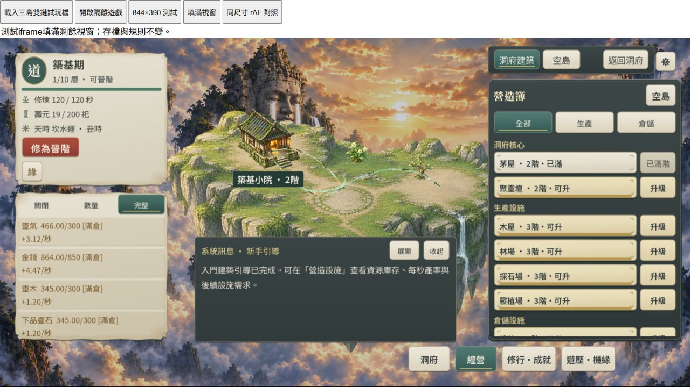

# RES1-C2-PERF-R2｜定時 View／保存編碼與長幀關聯

2026-10-04。本輪子階段交付；**R2／C／C2 IN_PROGRESS、D TODO**。嚴格 60FPS 未通過，沒有放寬門檻。現有未提交修改、玩家檔、收益／RNG／schema3／rules_version、即時命令保存與15秒保存／重試順序保留。

## 交付與固定快照證據

- `living_abode.gd`：只有 `_process` 的0.25秒定時 HUD 使用 `_refresh_hud(false)`，沿用既有 GameState 身分＋revision 保護的 View。命令／debug／載入／resize等明確呼叫維持預設強制重建。既有修行封頂寫入未增加revision，因此數值真正改變時清除 View，避免把封頂前資料留到下一次tick。未改封頂數值或收益。
- `save_codec.gd`：拆分驗證／快照／JSON往返／checksum／輸出計時；重用首次 JSON 序列化結果，於由引擎產生的頂層物件末尾加入固定名稱與64位SHA256 hex checksum，省略完整最後序列化。保留解析後checksum演算法與舊verify；不把 checksum 的近整數正規化 payload 當保存內容。JSON欄位順序改變，**不承諾字串bytes相同**，完整解析 envelope／checksum／數值保持。
- `tools/res1c2_encode_profile.gd`（含UID）：唯讀固定fixture、首次View暖機後固定快照，100次量測；同程序交錯先後執行舊encode與候選，110次完整解析envelope相等／decode通過、14組浮點邊界與巢狀繁中字串／跳脫案例通過，來源狀態hash不變。工具不讀user://存檔、不推进時間或RNG。
- 資源顯示runner新增定時不重建與revision後讀新貨幣的兩項回歸，總754 checks；前輪752為歷史結果。

原生初始拆分中位數：encode16.974ms；validate2.747、snapshot0.732、roundtrip4.744、checksum5.130、最後json2.501；View2.409ms。最終同程序交錯比較：舊encode **17.368ms**、候選 **14.9985ms**，約13.6%減少。候選包含新增計時分支成本；這是固定快照encode成本證據，不是整場景FPS改善。

fixture SHA256 `6e4fdf41a09153002c5eafe4508511d1731609ca54e4921c55addbc619956c0b`；暖機後snapshot hash見native-after原始日誌。全量runner稍後重生earned／offline隔離fixture，不覆寫玩家進度。第一次探針在暖機前取hash而得到unchanged=false，保留native-before.log；修正暖機邊界後baseline與after均exit0／unchanged=true，沒有隱藏首次View既有初始化。

## Web成本與FPS

Windows／IAB Chromium154；本機Brotli無節流、祖島、數量模式、正常特效、音樂預設，離線摘要關閉、訊息開啟、報告收起。全部取樣期間沒有Runner、匯出或壓縮並行。兩邊raw均記錄原MP3 01／02外載；未獨立驗證可聽輸出。實際遊戲 **1280×650 CSS／DPR1.25**；viewport override未反映於實際尺寸，不能稱1280×720或DPR1。844×390則以launcher的精確iframe測試。

同一4244 origin、相同fixture來源與HUD條件；沿用進度重開，前後時辰／年齡／自然離線8684與461秒／庫存不同。沒有清WASM cache或隨機交錯瀏覽器版本。**不宣稱嚴格同快照Web前後改善**。所有profile樣本排除正式FPS gate。

| 三組15秒CPU診斷 | HUD平均ms | View平均ms／含span的frame數 | encode單次ms | 最後JSONms | 保存總ms |
| --- | --- | --- | --- | --- | --- |
| 改前1 | 5.482 | 2.462／71 | 13.8 | 2.6 | 18.6 |
| 改前2 | 5.241 | 2.359／70 | 12.8 | 2.2 | 17.5 |
| 改前3 | 5.435 | 2.468／72 | 13.2 | 2.1 | 18.6 |
| 改後1 | 3.359 | 2.519／32 | 11.8 | 0.0 | 17.6 |
| 改後2 | 3.300 | 2.424／29 | 11.9 | 0.1 | 17.6 |
| 改後3 | 3.284 | 2.363／30 | 11.0 | 0.1 | 15.5 |

View單次仍約2.4ms；減少重建頻率而非宣稱每次View加快。封頂真正改值後仍需重建；HUD刷新56次不變。各span inclusive，不能相加；Web計時常呈0.1ms階梯，0.0代表小於可見量化，不代表零成本。保存commit4.3–5.7ms仍存在。

| 非profile | 三組FPS | pooled | p95 | max |
| --- | --- | ---: | --- | --- |
| 改前 | 59.9301／59.9972／59.7301 | 59.8858 | 均16.8ms | 33.5ms |
| 改後 | 59.9301／59.1302／59.7968 | **59.6190** | 均16.8ms | **183.3ms** |

六組嚴格60都未過。改後第二組183.3ms重現大尖峰，但非profile沒有CPU資料，不歸因保存／GC／GPU；FPS pooled本輪亦沒有改善可宣稱。

## 大長幀與CPU時間關聯

追加profile專用60秒選項（正常FPS仍15秒），以及PerformanceObserver LongTasks。只在隔離profile頁載入observer；無支援時明確記false。LongTasks最多1000列、GDScript最多10000列，有drop則摘要拒收；start清掉舊紀錄，stop取走尚未回呼的entry，保留跨sample起點的重疊task。這是瀏覽器task的elapsed duration，不是CPU樣本／call stack，也不是GPU時間。

兩個60秒樣本，3587／3595 CPU列，valid=true，CPU／task dropped均0，POST204，raw每組約415／421KB。這階段已完成真實木屋2→3命令與重載，故不併入上面的修改前後表。console warn/error空。

- 第一組最大 **166.8ms rAF**，endMs66636.2；與startMs66469.5、duration180ms、name=self的 **180ms LongTask** 重疊。同一近似窗口累計已量 `_process` body **0.3ms**；HUD、View、保存span均0。現有計時**未顯示大尖峰來自HUD／保存／View**，下一應量未覆蓋引擎／其他節點／task工作；仍不能指定GC、GPU、引擎函式或OS排程為原因。
- 第二組max49.9ms，瀏覽器另報一個53ms self LongTask；rAF compositor時間戳與bridge進入時刻非精確call-stack對齊，不保證task與gap一一對應。
- 較早三組15秒profile共有5個>20ms窗：其中一個33.4ms窗與save_total15.5ms／process15.7ms重疊，其他4個窗已量CPU僅0.2–0.4ms。只代表時間關聯，不能把整個gap算成保存耗時。

`_process`計時仍僅state.advance至mask結束，不包含前置Web Lock／背景await、其他節點、引擎繪圖、GPU、bridge輸出等；LongTasks也沒有函式歸屬。大尖峰已取得關聯資料，**根因尚未完全定位**。

## 驗證與命令

既有Godot `4.7.2.stable.official.ed1daf0bf`、Compatibility、单執行緒Web與模板保持。全部命令在專案根目錄，bundled runtime路徑見ai-handoff。

```powershell
& ./tools/godot/4.7.2/Godot_v4.7.2-stable_win64_console.exe --version
& ./tools/godot/4.7.2/Godot_v4.7.2-stable_win64_console.exe --headless --path . --script res://tools/res1c2_encode_profile.gd
powershell -NoProfile -ExecutionPolicy Bypass -File ./tools/run_all_runners.ps1
& ./tools/godot/4.7.2/Godot_v4.7.2-stable_win64_console.exe --headless --path . --script res://tests/res1c2_world_runner.gd
# native最終exit0；全量51/51 exit0（resource754、精確tick/font145、async27）；world26 exit0
& ./tools/godot/4.7.2/Godot_v4.7.2-stable_win64_console.exe --headless --path . --export-release Web build/web-profile/index.html
# 修改前細分baseline，exit0，保留供對照
& ./tools/godot/4.7.2/Godot_v4.7.2-stable_win64_console.exe --headless --path . --export-release Web build/web/index.html
& ./tools/godot/4.7.2/Godot_v4.7.2-stable_win64_console.exe --headless --path . --export-release WebPersistenceTest build/web-persistence/index.html
node tools/prepare_web_compression.mjs build/web-profile
node tools/prepare_web_compression.mjs build/web
# exports／compression exit0，原MP3 companions與壓縮roundtrip通過
node tools/test_runtime_profile.mjs
node tools/test_frame_metrics.mjs
python tools/test_runtime_profile_summary.py
python tools/summarize_frame_metrics.py --self-test
# profile含LongTasks契約、observer9、summary4、FPS摘要8通過
python tools/summarize_runtime_profile.py docs/verification/artifacts/res1-c2-encode-long-profile-metrics.jsonl --output docs/verification/artifacts/res1-c2-encode-long-profile-summary.json
git diff --check
# summaries／diff exit0，既有CRLF notices保留
```

正常PCK `53d3400c6772a9250af5cc8079a04b3d01a55ce75718736471f2f9d8999d21e3`；baseline PCK `873b3e7b45f50697370d013efaa0fdb31bd03664a11494110e30fd145e81b25a`；WASM仍`fc74679e3b97f76878947fcd4fbe1268cbfa6188182a2e33bbc3f5dc9bfa57d0`。正常核心br14,451,027 bytes。未手改匯出物、更新環境、commit／push／部署。

真實Web：新origin4245 `c2retry` **49 checks PASS**，故障收據／完整終態／重試無重複收益通過，證據追加web-persistence-browser.jsonl；未重跑完整146案桌面矩陣或20Mbps／100ms48h。正常4244真實滑鼠完整／數量模式、木屋2→3扣料／產率容量立即更新、重載仍3階且只新11秒摘要、844×390內部捲動／模式／固定返回、回桌面通過。觸控／手機、高DPR2/3、自然凍結、其他瀏覽器、長期WASM／GPU與人工美術節奏仍待驗。

失敗／限制：第一次sandbox4244服務瀏覽器timeout，停止後正常授權loopback可讀；native唯讀probe的user://log拒寫診斷保留。world／部分runner既有Font／CanvasItem／ObjectDB退出診斷保留，不稱零錯誤。長樣本完成後展開raw導致AX觀測逾時，恢復連線、收起報告並以服務端raw核對；該事件在取樣完成後，沒有將timeout算成遊戲效能。工具最後的note文字修訂在兩次長樣本之後，純說明文字不改計時。

完整raw／摘要／日誌／截圖在`artifacts/res1-c2-encode-*`。FPS原始選取檔只保留完整raw中無runtimeProfile的原行，未改指標。前輪HUD dirty工作與證據保留。

保留[4244正常隔離試玩](http://127.0.0.1:4244/launcher?metrics=1)，已有進度按開啟隔離遊戲，拒覆寫；前輪4243本輪確認入口可讀但沒有開其存檔。4245保存探針服務已停止，未中斷其他服務。若需續診斷：`python tools/island_preview_server.py --port 4244 --normal-build --gzip --review-fixture --metrics-log res1-c2-encode-long-profile-metrics.jsonl`，頁面`/launcher?profile=1&profileSeconds=60`；此為loopback，不是手機部署。

依AGENTS Context Guard在此子階段checkpoint，英文置updata.txt頂部，同步development-status。下一New Chat續同R2：未覆蓋task／引擎／其他節點耗時與根因追蹤，再補嚴格FPS與裝置／人工缺口，不進D。


