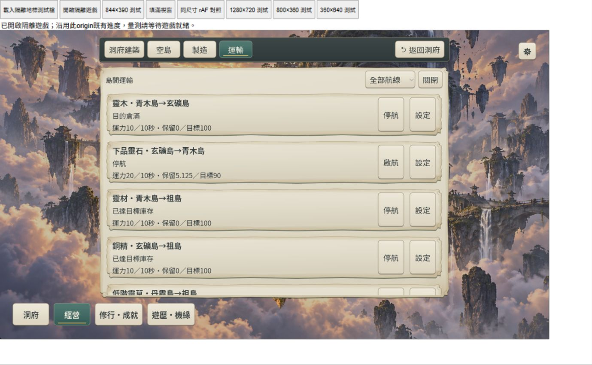

# RES1-UI1-B：運輸精簡驗收

完成：2026-10-09（Asia/Taipei；10/8開始，跨午夜收尾）。**DONE：有界B範圍**。完整UI1-C／RES1-C/D裝置、自然時間玩法、保存故障與性能門檻保持待驗。

七航線 wood_ore／ore_wood／timber_home／bronze_home／grass_home／herb_home／liquid_home 全數保留。列表只顯示貨種、方向、狀態、運力及已保存政策摘要，啟停與設定分開；標題固定的島篩選包含該島進出航線，全部可清除篩選。詳情取代同一捲動工作區，固定返回／Escape先回航線，再回洞府；保留清單位置。沒有新增全網啟動、派遣、畫航線或正式HTML玩法。

## 修改檔案與行為

- `src/presentation/island_transport_panel.gd`：重用七列及單一詳情；設定用LineEdit保留Amount契約內小數／上限1e12的原字串，核心驗證非法值。草稿按route_id留在呈現記憶體；刷新、返回、切頁、升階和啟停不偷偷套用或抹掉草稿。列表／詳情明示未保存，只有保存按鈕提交；本次遊戲關閉後不保留草稿。啟停／升階使用已保存政策，保存設定保留enabled。未配置啟航沿reserve0／target100／level1；設定仍可查看未開拓端點與開拓捷徑。原設定下的停航貨物仍到達。
- `src/simulation/island_economy.gd`：出航載量計算抽為唯讀`departure_info`，tick與`transport_view`共用原公式；沒有修改成本／時長／方向／守恆／排序。View精確區分無餘貨、達目標、滿倉、停航、在途與等待下次出航，容量預留只計一次。只有實際滿載、來源餘貨、目的需求及空間同時存在，才顯示「本趟滿載，來源仍有餘貨」，不把無貨猜作運力不足。
- `src/application/game_session.gd`：暴露唯讀transport View。`src/presentation/manufacturing_panel.gd`／`feature_navigation.gd`：缺料按貨種＋目的島定位實際route_id；產物满倉按來源＋產物定位回運；共用靈力、當地草及沒有固定輸入航線的祖島玄銅仍走本地／洞府。反向航線缺加工貨可定位來源配方，缺原貨到來源採集，祖島滿倉到建築；捷徑只導航，不扣料、不自動改設定。
- 新增 `tests/res1_ui1b_runner.gd`、`tools/res1_ui1b_preview.gd`及Godot產生的UID；更新`tests/res1_ui1a_runner.gd`舊upgrade入口及`tools/run_all_runners.ps1`（56項）。原生九張PNG、独立命令生成review envelope、Web五張截圖與命令日誌放在`docs/verification/artifacts/res1-ui1-b*`。
- `assets/fonts/runtime/Dao2Sans-VF.ttf`／`Dao2Serif-VF.ttf`／`manifest.json`：新文案子集缺字後以既有工具重產；原始字型唯讀，1823 codepoints／字重軸與metrics檢查通過；既有SIL OFL1.1及原版授權保留，不新增美術素材。

未改schema3、economy res1-d-2、rules_version core-flow-12-ui1a-era1-alchemy、配方或玩家資料。舊res1-b-1運力升階仍支付祖島靈木20；res1-d-2仍支付祖島靈材2＋銅精2。正式UI只送configure_route／既有命令。

## 命令與結果

本機引擎 `tools/godot/4.7.2/Godot_v4.7.2-stable_win64_console.exe --version` exit0：`4.7.2.stable.official.ed1daf0bf`，Compatibility／單執行緒Web保持。PowerShell執行以下專案命令；引擎user://權限依專案既有授權放行。

| 命令 | 結果與日誌 |
| --- | --- |
| Godot `--headless --path . --import` | exit0，新增UID與字型匯入；`res1-ui1-b-import.log` |
| `powershell -NoProfile -ExecutionPolicy Bypass -File tools/run_all_runners.ps1` | **56/56、exit0**；當輪A127／B138；`res1-ui1-b-all-runners.log` |
| Godot `--headless --path . --script res://tests/res1_ui1b_runner.gd` | 最終 **140 checks、exit0**；追加反向原料／製造供給；`res1-ui1-b-runner-final.log` |
| Godot `--headless --path . --script res://tests/abode_presentation_parity_runner.gd` | 最後exit0；`res1-ui1-b-parity.log` |
| Godot `--path . --script res://tools/res1_ui1b_preview.gd` | 最後exit0，三尺寸各routes／settings／draft共9張PNG；`res1-ui1-b-native-final.log` |
| bundled Python `tools/subset_game_fonts.py`與`--check` | 重產／最終字型契約exit0；`res1-ui1-b-fonts.log`／`res1-ui1-b-font-check.log` |
| Godot `--headless --path . --export-release Web build/web/index.html` | 最終exit0；`res1-ui1-b-web-export-final.log` |
| bundled Node `tools/prepare_web_compression.mjs build/web` | 最終exit0、Brotli往返與四首BGM companions；`res1-ui1-b-compression-final.log` |
| bundled Python `tools/island_preview_server.py --port 4292 --normal-build --fixture res1-ui1-b-review.json --gzip` | 新隔離origin正常提供最終Web；只讀本origin存檔，不存取4175。驗後Ctrl+C停止，exit1是主動終止。 |

最終PCK SHA256：`1478bde829dbf26cfbed01d43d0cd687434cfa25327a8255617a8fc094be41db`，核心br **26,778,805 bytes**，不是性能放行。全量通過後僅追加UI雙向捷徑／上限文案與兩項專項，再跑140與parity；不把全量當輪138寫成140。

140專項涵蓋每條航線初始預設、字串小數5.125／83.75、四次刷新、返回／切頁／重開草稿、保存、停航／重新啟動／升階保持政策與草稿、祖島付費一次，及實際tick出航→停航升階→重啟不複製貨→再停航當趟仍到貨。另有純View達標／容量／無餘貨／滿載證據、未開拓捷徑、精確缺料／輸出回運、無路徑fallback、1e12上限與負值原子拒絕、拒寫／保存重試不再送命令、解碼重載、舊版成本和50次頁面／詳情切換節點／全狀態不變。

測試用診斷clone補足材料驗UI成本與命令，不宣稱正常玩家獲贈材料；review envelope只重封既有命令生成Era3 fixture。隔離`user://res1_ui1b_runner`／`user://res1_ui1b_preview`及MemoryAdapter，未寫玩家存檔。全量工具按既有流程重產earned／offline fixtures。未commit／push，保留前輪dirty工作區。

## 真實Web與畫面證據

IAB/cua_repl，DPR約1；瀏覽器viewport override1380×850容納測試iframe。唯讀DOM矩形核對iframe **1280×720／844×390／800×360 CSS**；Godot畫布Adaptive，沒有外部捲動替代內容。不是實體裝置。

- 桌面實際經營→運輸，七列都可捲到；停ore_wood時可見「載貨5／6秒、停止新出航；當趟仍會到貨」，之後貨物到達且保持停航。輸入保留5.125／目標83.75，刷新／返回／重開保留草稿及列表提示；保存再升階，畫面停航、20運力、自訂值均保持。
- 844×390詳情固定返回／上分頁／底四入口可用；Godot內捲到目標欄，修改目標90，再捲到保存並返回；列表能捲到丹霞最後丹液航線，未使用外部浏览器捲軸。
- 800×360丹液設定可開啟，360×640旋轉罩阻擋背景操作，轉回800×360仍選丹液詳情；這是有界旋轉恢復，字級放行／實體觸控另待驗。
- 最終匯出後真正reload launcher，按「開啟隔離遊戲」沿舊資料，未再seed；重新進運輸可見ore_wood **停航、運力20／10秒、保留5.125、目標90**。最終丹液「來源供給」按鈕直接打開丹液／丹霞製造詳情，未發送加工命令。browser error／warn查詢空。
- 本輪Web截圖已成功保存：`res1-ui1-b/web-stopped-upgraded.png`、`web-844-list.png`、`web-800-restored.png`、`web-reload-policy.png`、`web-source-liquid.png`。原生PNG逐項檢視，短橫式篩選改固定標題以留出一列完整操作空間。

## 失敗嘗試、限制與下一步

初期誤用不存在的UiTypography.apply_label導致編譯失敗，改用現有font／size覆寫；沙箱user:// startup失敗與旧A Runner查已撤下upgrade欄導致中斷，Ctrl+C後修正新詳情入口並重跑。B初版三項測試失敗來自測試來源／目的同時達標、誤用1000而正式靈材容量1000000、及hud尺寸與root.viewport不一致；修正fixture／實際viewport後138通過。這些初期失敗沒有當成通過。

字型初次`--check`九字缺漏exit1，重產後exit0。Web早期未擴viewport使1280iframe被maxWidth縮成直式，改以可容納實測尺寸的override；一次typeText多字輸入只落第一字，改實際逐鍵輸入並截圖確認完整小數，不據此稱已驗貼上／手機鍵盤。Web截圖首次隨resize短暫滯後，依最新截圖重新定位，不盲重複點擊。

成功日誌沒有SCRIPT ERROR；仍有原有Font RID／CanvasItem／ObjectDB退出診斷、負面保存／JSON錯誤，不能稱所有日誌零錯誤。服務favicon.ico 404保留，正式JS／WASM／PCK／音樂回應200。未驗Web拒寫矩陣／雙分頁、IndexedDB、實體橫式觸控／DPR2–3、FPS／GPU長觀測、自然時間完整首段與使用者易用性放行；沒有同步Windows包。56回歸與50次CLI穩定節點不能替代這些證據。

收尾：本輪唯一IAB分頁已關閉，viewport override reset，4292服務Ctrl+C退出1（主動終止）；其他服務／分頁不變。18份主要文字嚴格UTF-8／278個本地連結通過，四份最終成功日誌無SCRIPT ERROR；限定git diff --check exit0。搜尋SCRIPT ERROR的rg無命中回傳1，與差異檢查失敗區分。

依Context Guard完成B後停止，不展開C。英文checkpoint寫入updata頂部，同步README／ROADMAP／development-status／docs12／16及M2-D驗收指標。**下一New Chat：RES1-UI1-C完整Web／保存故障／裝置／效能／人工操作驗收**；不重做RES1-A/B或擴Era4，完整RES1-C/D限制保持。
