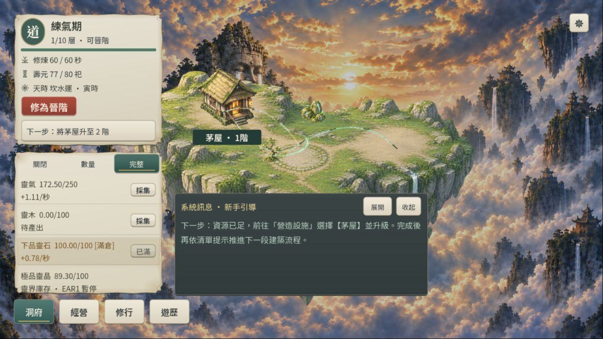
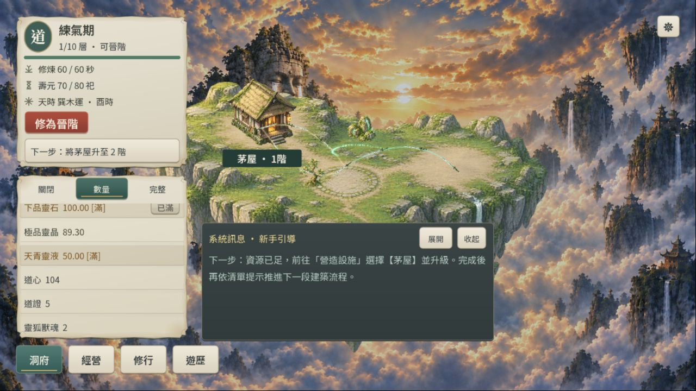
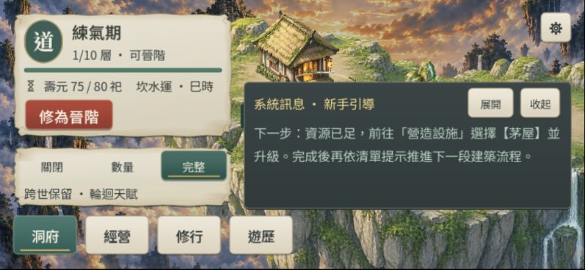

# RES1-B-R1／UI 資源列修復

2026-10-03，依使用者截圖優先處理 EAR1 下品靈石被動下降，以及靈界／跨世資源未排版。此子項 DONE，不代表 RES1-B 正式 Web 保存門檻或整體 UI 已完成。

## 根因與變更

輪迴保留 `realms_data.outposts`，靈界因輪迴次數仍解鎖；舊 `RealmSystem.tick` 在 EAR1 也運轉天樞陣眼。10 級陣眼每秒消耗 2 下品靈石，但截圖採石場只產出 0.78／秒；低存量時因不足整批而停轉，補足後再扣，形成鋸齒。舊邏輯也在靈晶／靈液滿倉時先扣原料再截掉產物。

- EAR1 暫停靈界背景生產、消耗及對應修煉回饋；保留設施、庫存與入口，Era2 起恢復。
- 先算產物剩餘容量與可用原料，再按實際轉換量扣料；滿倉零消耗，接近滿倉／缺料允許部分轉換。移除扣款時意外把大額合法原料截成 999999999 的 clamp。這是 v2 修正，非舊版 parity。
- 裸 `currencies: Label` 改成既有 BuildingCatalog 卡片：極品靈晶／天青靈液有庫容，道心／道證／獸魂無庫容；無採集按鈕，完整模式顯示靈界暫停或跨世用途。全部參與共用高度計數、三態模式與 ScrollContainer；刷新不重建既有卡片，移除的跨世資源隱藏。
- rules metadata 升至 `core-flow-7-realm-capacity-gates`，schema 仍為 3，既有 schema2／3 讀取路徑不變。未自動啟用 RES1-B opt-in 經濟。

## 來源

`src/simulation/realm_system.gd`、`src/presentation/building_catalog.gd`、`src/presentation/feature_navigation.gd`、`src/persistence/save_codec.gd`、`tests/resource_feedback_runner.gd`／同名 `.uid`、`tests/feature_navigation_runner.gd`、`tools/run_all_runners.ps1`、`tools/resource_feedback_web_fixture.gd`／`.uid`、`tools/resource_feedback_web_server.py`；本驗收、rule-differences、ROADMAP、development-status、updata。

## 命令與結果

使用現有 `tools/godot/4.7.2/Godot_v4.7.2-stable_win64_console.exe`；版本輸出 `4.7.2.stable.official.ed1daf0bf`。Godot 命令皆以 `--headless --path .` 執行，必要 user:// 權限使用已授權升權。

| 命令／Runner | 結果 |
| --- | --- |
| `--script res://tests/resource_feedback_runner.gd` | exit0，738 checks；600 個一秒 tick 靈石不下降、EAR1 庫存及回饋凍結、Era2 全滿／近滿／缺料扣量；真實場景兩尺寸三態共用卡片 |
| `m4a_realm_runner`、`m4a_session_integration_runner`、`m3a_reincarnation_runner` | exit0，跨界、Session 251 checks、輪迴保存回歸 |
| `feature_navigation_runner`、`m2d_responsive_ui_runner`、`res1b_economy_runner` | 最終 exit0，導覽中立性／UI 命令、響應式邊界、RES1-B 251 checks |
| `--script res://tools/resource_feedback_web_fixture.gd` | exit0，產生隔離測試快照 |
| `--export-release Web build/web/index.html` | exit0，同版模板，未手改匯出 HTML |
| `python tools/resource_feedback_web_server.py` | 啟動 127.0.0.1:4192/resource-setup；新增 origin，guard 保留既有 main／backup |

最初導覽回歸仍引用已移除的 `nav.currencies`，SCRIPT ERROR 後 SceneTree 未退出；只終止匹配該 Runner 的測試程序、更新斷言後重跑通過。初輪 exit1 保留。故障注入的 broken JSON 訊息、既有 Godot 關閉 Font／CanvasItem RID 與 ObjectDB 診斷保留，不能稱日誌零錯誤。未再跑全量 Runner；前輪 RES1-B 44/45 的 DebugActions 失敗狀態仍保留。

日誌：[新 Runner](artifacts/resource_feedback_runner-resource-r1.log)、[導覽首次](artifacts/feature_navigation_runner-resource-r1.log)、[導覽最終](artifacts/feature_navigation_runner-resource-r1-final.log)、[響應式](artifacts/m2d_responsive_ui_runner-resource-r1-final.log)、[RES1-B](artifacts/res1b_economy_runner-resource-r1-final.log)、[Web 匯出](artifacts/resource-feedback-web-export.log)。其餘相關日誌檔名為 `<runner>-resource-r1.log`。

## 真實瀏覽器

IAB 4192 origin，經 setup 按鈕載入 EAR1／3 次輪迴、hub10／pool10、靈晶89.3／靈液50、道心104／道證5／靈狐獸魂2；未讀寫玩家4175 origin。使用 computer-use skill 與 CUA browser API 取得截圖並實際滑鼠點擊／捲動。

- 1280×720：靈石98.53→100並維持滿倉；靈晶89.3／靈液50不變。完整／數量切換、共用卡片、庫容狀態、捲到獸魂可讀。
- 844×390：完整／數量／關閉均可點、卡片窗內可捲到最後資源與第二行，關閉隱藏全部資源。沿用既有短橫向小視窗，完整卡片無法同時完整呈現兩行，需逐行捲讀；未宣稱已擴充資源抽屜。
- 返回桌面重載：離線摘要正常，靈石100／靈晶89.3／靈液50仍保留。瀏覽器 warn/error 收集為空；此證據不涵蓋 IndexedDB、quota、多分頁或實體手機／高 DPR。

下一大型任務仍是 RES1-B／M1-C/D Web 保存故障矩陣，再 RES1-C；本次未展開。
