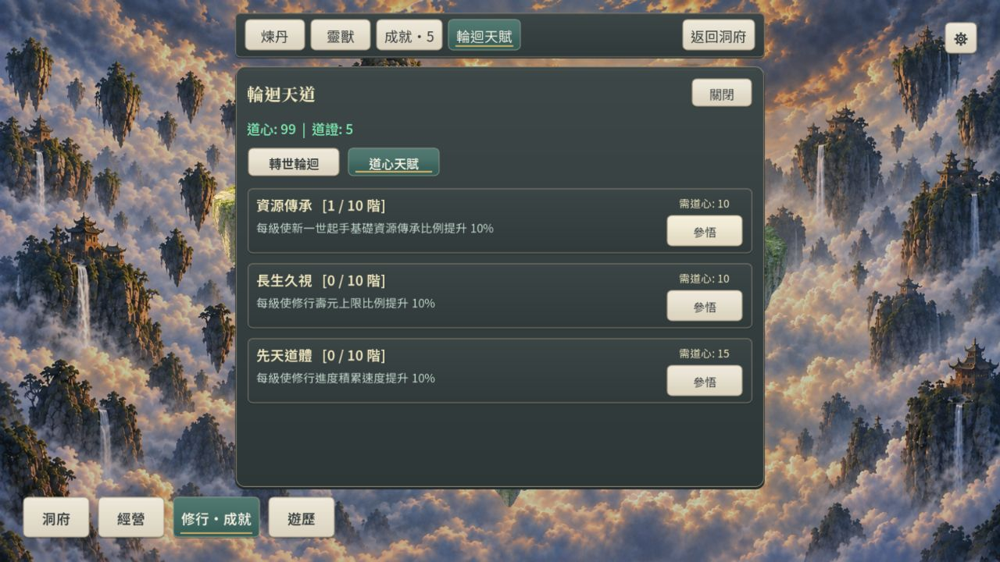
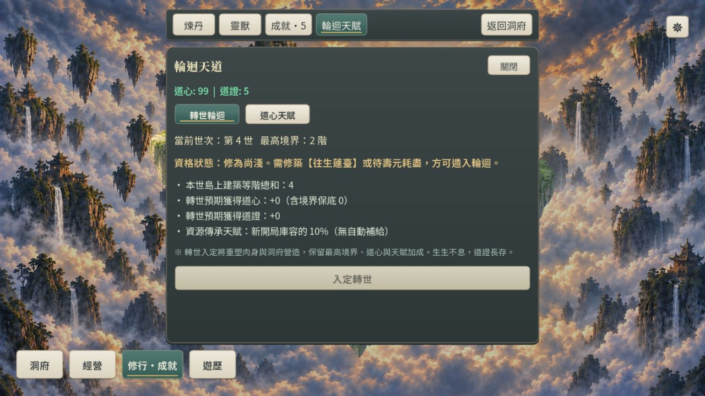
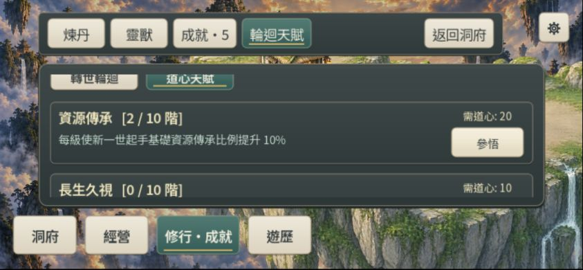

# M3-A-R2：取消自動起手補給／道心天賦空白修復

2026-10-03，使用者明確選擇「取消自動補給；資源傳承天賦每級提供10%」。此子項 DONE；不擴張成整體輪迴平衡或實體手機驗收。

## 最終行為與範圍

- 取消第1次40%／第2次起80%的自動補給。不論輪迴次數，未購資源傳承天賦就沒有基礎物資發放。
- 資源傳承0–10階對應0–100%新開局庫容，向下取整；發放限輪迴開局已解鎖的基礎資源，下次轉世生效。仍非前世庫存百分比。天賦等級、成本與其他天賦效果保持。
- 預覽與發放共用 `ReincarnationRules.inheritance_ratio`。購買當下不補庫存，不回收已載入存檔的現有物資。
- rules=`core-flow-8-talent-only-inheritance`，schema3保持。舊版40%／80% JSON golden fixture原樣保留；道心／道證獎勵仍作legacy parity，起手供給明確轉為v2差異。
- 在真實Web重現天賦分頁整頁空白：外層ScrollContainer內容內再套一個expand的ScrollContainer，內層高度為0。移除內層，天賦卡片直接交給外層捲動；參悟按鈕最小高度44。購買仍走Session、扣道心、保存。

先前自動補給可縮短重開前段，但80%底額讓天賦兩階即封頂、之後八階沒有額外發放，與升級體驗衝突。取消的代價是未點天賦時重走採集／重建；正向流程已確認零物資仍可免費採集重建茅屋，沒有用新補給抵銷取消效果。未量測長期重玩節奏。

靈界`realms_data`無條件跨世保留仍是獨立未定契約；本輪不改其清除政策，不把它當資源傳承天賦的效果。RES1-B正式保存門檻仍IN_PROGRESS。

## 修改檔案

`src/simulation/reincarnation_rules.gd`、`src/simulation/talent_system.gd`、`src/presentation/reincarnation_panel.gd`、`src/persistence/save_codec.gd`、`tests/m3a_reincarnation_runner.gd`、`tests/m3a_reincarnation_ui_runner.gd`、`tests/core_positive_flow_runner.gd`；本驗收、rule-differences、development-status、ROADMAP、updata。

## 命令與結果

現有Godot4.7.2 console，同版Web模板；以`--headless --path . --script res://tests/<runner>.gd`執行隔離存檔回歸。

| Runner／命令 | 最終結果 |
| --- | --- |
| m3a_reincarnation_runner | exit0；無天賦零發放、各輪迴次數0–10階有效、購買不即時發料、下一世10%與保存往返、舊golden未覆寫 |
| m3a_reincarnation_ui_runner | exit0；真實卡片取得高度且參悟在視口內、購買／發料／轉世演出 |
| core_positive_flow_runner | exit0；零庫存輪迴後可透過免費採集重建茅屋 |
| res1b_economy_runner | exit0，251 checks；加工／貨物／保存及輪迴回歸 |
| feature_navigation_runner | exit0；功能導航與UI命令 |
| resource_feedback_runner | exit0，738 checks；EAR1靈石與共用卡片回歸 |
| `--export-release Web build/web/index.html` | 最終exit0；未手改build輸出 |

日誌：`artifacts/<runner>-talent-r1.log`；輪迴最終為[m3a_reincarnation_runner-talent-r1-final.log](artifacts/m3a_reincarnation_runner-talent-r1-final.log)，[匯出](artifacts/talent-r1-web-export.log)。首次輪迴Runner exit1因JSON浮點Array與整數Array整體比較；改為逐值轉int核對歷史測資後通過。保留首次日誌。故障注入broken JSON與既有關閉RID/ObjectDB診斷仍在，未宣稱日誌無錯誤。沒有重跑全量。

## Web操作證據

computer-use skill／CUA，使用前輪隔離origin4192（未讀寫玩家4175）：

1. 舊版「修行→輪迴天賦→道心天賦」整頁空白已親自重現。
2. 重匯出重載後，1280×720三張天賦可見。實際按參悟：道心104→99、資源傳承0→1，輪迴預覽0%→10%。
3. 844×390可在外層捲到完整卡片並實際按參悟，等級1→2。
4. 重載後道心89／等級2保留，預覽20%，console warn/error空。臨時viewport已reset；本輪未驗IndexedDB、quota、多分頁、實機觸控或高DPR。

下一步：收取輪迴節奏與靈界跨世政策回饋；大型RES1-B／M1-C/D保存矩陣用New Chat接續。
